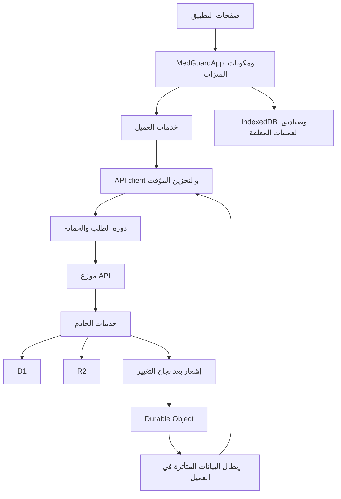

# تحليل بنية Qraft استعدادًا للتعديل

تاريخ المراجعة: 1 أكتوبر 2026، بتوقيت الرياض.
النسخة المرجعية: `8394056`، وكان مسار العمل نظيفًا عند بداية المراجعة.

## الخلاصة الهندسية

المشروع الموجود داخل `app/` هو تطبيق Qraft لبنوك الأسئلة الطبية، رغم بقاء اسم MedGuard في بعض الملفات والتخزين المحلي. التطبيق يجمع الدراسة والاختبارات الشخصية والاختبارات الجاهزة والبطاقات والمساهمة والمراجعة والاشتراكات والدعم والإدارة.

البنية الحالية تطبيق واحد بوحدات ميزات، مع فصل جزئي للعميل والخادم وقواعد المجال. الفصل حقيقي في بعض الميزات، لكنه انتقالي في المصادقة والحالة والتعاون: عدة ملفات داخل `features/*/server` تعيد تصدير التنفيذ الكبير من `lib/cloudflare-server.ts`. لذلك وجود مجلدات منفصلة لا يعني استقلال التنفيذ كاملًا.

يمكن إجراء تعديلات مركزة على البنية الحالية. الأولوية لفهم العقد السلوكي ومسار الحفظ والصلاحيات لكل تعديل، ثم تغيير أصغر نطاق ممكن. لا يوجد دليل من هذه المراجعة يستدعي إعادة كتابة التطبيق أو تغيير المنصة.

## نطاق المراجعة

- مراجعة إعدادات التشغيل والتبعيات والمسارات ومداخل العميل والخادم.
- تتبع تحميل الحالة والحفظ المحلي والسحابي والتعارضات والتعاون والإشعارات.
- قراءة نماذج البيانات والصلاحيات ومسارات الاختبارات والاستيراد والوسائط والإدارة.
- مقارنة بعض الوثائق التاريخية بالتنفيذ الحالي.
- تشغيل اختبارات المشروع وفحوص الأنواع والجودة واختبارات قاعدة بيانات معزولة.

لم يتغير كود التطبيق أو بيانات المستخدمين، ولم تُشغّل ترحيلات على قاعدة فعلية أو عملية نشر. أُضيف هذا التقرير، وولدت أدوات التحقق مخرجات محلية داخل المسارات المستثناة من Git. لم تُقرأ ملفات الأسرار الفعلية.

## التقنية والتشغيل

| الجزء | التنفيذ الحالي |
|---|---|
| الواجهة | React 19، TypeScript بوضع strict، Tailwind CSS 4 |
| الإطار والبناء | vinext وVite؛ مسارات متوافقة مع بنية App Router |
| الخادم | Cloudflare Workers، ومدخله `worker.ts` |
| قاعدة البيانات | D1/SQLite، SQL مباشر في طبقة الخادم، وتعريفات Drizzle |
| الملفات | R2 عبر `lib/storage-service.ts`، مع توافق لسجلات ImageKit القديمة |
| الإشعارات | Worker مستقل وDurable Object في `workers/realtime.ts` |
| البيانات المحلية | IndexedDB، قاعدة باسم `medguard-qbank` |
| العمل المثبت | PWA، manifest وService Worker في `public/` |
| البطاقات | جدولة FSRS محلية باستخدام `ts-fsrs` |
| الاختبارات | Node test runner، ومحاكاة Miniflare/workerd وD1، وSQLite في Python |

وجود `next.config.ts` أو استيرادات `next/*` لا يغير حقيقة أن أوامر التشغيل والبناء الحالية تستخدم vinext. المرجع التنفيذي هو `package.json` و`vite.config.ts` و`worker.ts`.

## خريطة الملفات والمسؤوليات

| المسار | المسؤولية وأثر التعديل |
|---|---|
| `app/` | 20 صفحة، منها المسارات الوظيفية وصفحة offline؛ معظم الشاشات تدخل التطبيق الجذري عبر `QraftRoute` |
| `components/medguard-app.tsx` | إدارة الحساب والحالة والتنقل والاختبارات والمزامنة وتكوين الشاشات |
| `components/*workspace.tsx` | واجهات البنوك والمراجعة والبطاقات والاختبارات الجاهزة والاشتراكات والدعم |
| `components/presentation/` و`features/presentation/` | عرض سطح المكتب واللوحي والهاتف وبيئة PWA |
| `components/ui/` | المكونات المشتركة مثل الحوارات والأزرار والحقول |
| `features/*/domain/` | قواعد مستقلة نسبيًا: الصلاحيات والاشتراكات والتكرار والمصادر والتاريخ وحدود الحالة |
| `features/*/client/` | طلبات ومزامنة الميزات في المتصفح |
| `features/*/server/` | مداخل خدمات الميزات؛ بعضها تنفيذ وبعضها واجهات انتقالية |
| `lib/application-services.ts` | واجهة تجميع الخدمات التي يستخدمها التطبيق الجذري |
| `lib/api-client.ts` و`lib/resource-data.ts` | نقل HTTP وتوحيد الأخطاء ومشاركة الطلبات المتزامنة والتخزين المؤقت والإبطال |
| `lib/local-db.ts` | الحفظ المحلي وصناديق العمليات المعلقة ومحاولات الاختبارات الجاهزة |
| `server/api/` | توزيع API ودورة الطلب المشتركة |
| `server/http/` | قراءة الطلبات، فحص المصدر، الحماية من كثرة الطلبات، الردود والرؤوس الأمنية |
| `lib/cloudflare-server.ts` | التنفيذ الأساسي للمصادقة والحالة والتعاون وبعض عمليات البنوك والوسائط |
| `lib/platform-server.ts` | الاستيراد والمراجعة والاشتراكات والاقتصاد والتصنيفات والنسخ الاحتياطية وغيرها |
| `lib/preformed-test-server.ts` | دورة الاختبارات الجاهزة والتصحيح والنتائج والمحاولات |
| `db/schema.ts` و`drizzle/` | تعريف الجداول والترحيلات؛ يوجد 29 ملف ترحيل SQL |
| `scripts/` و`.github/workflows/` | البناء والتحقق والنشر والترحيلات والتشغيل المستمر |

أحجام الملفات التالية تشمل الأسطر الفارغة، وقد تتغير مع أي تعديل:

| الملف | الأسطر |
|---|---:|
| `components/medguard-app.tsx` | 7,728 |
| `lib/cloudflare-server.ts` | 3,556 |
| `lib/platform-server.ts` | 3,048 |
| `components/collaboration-dashboard.tsx` | 3,140 |
| `components/preformed-tests-workspace.tsx` | 2,558 |

## مسار الطلب والبيانات

مدخل API في `app/api/cloudflare/[...path]/route.ts` رقيق ويعيد تصدير المعالجات من `server/api/cloudflare-router.ts`. دورة الطلب في `request-lifecycle.ts` تتولى فحص المصدر للكتابة، وحدود الطلبات، ومطابقة الحساب المتوقع، ووضع الصيانة، ومعالجة الأخطاء وإشعار التغيير بعد نجاحه.

يستقبل `worker.ts` اتصال WebSocket قبل تسليم الطلب إلى vinext، للحفاظ على استجابة الترقية HTTP 101. ينفذ كذلك وظائف النسخ الاحتياطية والتنظيف وانتهاء الاشتراكات المجدولة.

## ملكية البيانات

### الحالة الشخصية

`AppState` تضم التقدم والاختبارات والملاحظات الخاصة والتظليل والبطاقات والإعدادات. تحفظ محليًا بمفتاح `state:uid`، وسحابيًا في `app_states.payload` مع `revision` وسجل عمليات لمنع إعادة تطبيق الطلب نفسه.

حفظ الحالة المحلية سريع: أثناء الاختبار دون تأخير مقصود، وخارجه بتأخير 200 مللي ثانية. توجد نقاط حفظ صريحة للاختبار والبطاقات والهدف اليومي، وحفظ عند الانتقال للخلفية أو المغادرة. إعادة الاتصال تعيد إرسال العمليات المعلقة. تغيير البطاقات والدفاتر له مسار حفظ تلقائي منفصل.

**قاعدة الدمج الشخصية حاسمة:** `mergeAppStates` تختار نسخة كاملة بحسب أحدث وقت تعديل، وعند التعادل تفضل نسخة الخادم. لا توحد حقولًا مستقلة من جهازين. هذه سياسة منصوص عليها داخل التنفيذ، وليست دمجًا دقيقًا لكل إجابة. أي تغيير فيها يحتاج تحديد السلوك المقصود واختبار التعارضات والحذف أولًا.

حد الحالة الانتقالي هو 1,500,000 بايت، مع تحذير عند 1,200,000. هذا حد هندسي للحفظ، مستقل عن الاشتراك. تراكم سجل الدراسة والبطاقات يجب أخذه في الاعتبار عند إضافة بيانات جديدة إلى `AppState`.

### الحالة المشتركة

`CollaborationState` تشمل البنوك والعضويات والدعوات والمقترحات والأسئلة المعتمدة والملاحظات والإحصاءات. البيانات المحلية معزولة بمفتاح `collaboration:uid`، وتوجد عمليات معلقة ومسودات مرفوضة محفوظة للتعافي.

العميل يولد فروق `set/delete`، والخادم يتحقق من الصلاحيات والعلاقات ثم يكتب دفعة D1. كثير من العناصر تحفظ في `records` مع أعمدة نطاق وفهرسة، ويظل المحتوى في JSON.

`mergeLiveState` يستخدم دمجًا ثلاثيًا بين أساس سابق ونسخة محلية ونسخة الخادم. حذف عنصر على الخادم له أولوية تمنع إحياء وصول أُلغي. هذه السياسة مختلفة عن اختيار النسخة الكاملة في الحالة الشخصية.

## المسارات الوظيفية الحساسة

- **المصادقة:** جلسة Cookie آمنة؛ تخزن تجزئة رمز الجلسة. يوجد PBKDF2 لكلمات المرور وTOTP للمسؤول الأعلى. `currentUser` يفحص التحقق والحظر في الخادم، ويشارك نتيجة التحقق داخل الطلب نفسه.
- **البنوك والصلاحيات:** السياسات الأساسية في `features/access/domain/access-policy.ts`. المراجع العام يراجع البنوك العامة، أما البنك الخاص فيحتاج دورًا داخل البنك، مع امتياز Superadmin المقصود. إنشاء وحذف البنك لهما مسارات صريحة.
- **الاختبارات الشخصية:** `TestSession` تخزن معرفات الأسئلة والإجابات والحالة والمؤقت، ولا تحتوي نسخة تاريخية من نص كل سؤال ومفتاحه. التصحيح أثناء الدراسة يجري في الواجهة، والحفظ الشخصي لا يمثل نظام نتائج رسميًا مصححًا بالكامل على الخادم.
- **الاختبارات الجاهزة:** لها وثيقة أسئلة وإعدادات وإصدارات ومحاولات وخصوصية ونتائج مستقلة. التصحيح في الخادم؛ لا ينبغي خلط هذا المسار بالاختبار الشخصي.
- **المساهمات:** مقترحات ومراجعات وسجل إسناد. يوجد مسار تعديل مباشر منفصل للمسؤول الأعلى المتحقق، مع فحص إصدار؛ هذا امتياز مقصود وليس إزالة لدورة مراجعة المستخدمين.
- **الاستيراد:** قراءة JSON في Web Worker، تحقق وإصلاح للمدخلات، بصمة ملف، فحص تكرار ضمن البنك، وتقرير نتائج. هناك حدود عادية وحدود إدارية مستقلة؛ حد المستخدم العادي الأعلى للدفعة 150 سؤالًا، وقد يكون حد حسابه أقل.
- **الوسائط:** وصول محمي إلى R2، وفحص النوع والحجم وبصمة المحتوى، وتنظيف للتعافي من الفشل والحذف. البيانات القديمة تحتاج الحفاظ على توافقها.
- **المراقبة:** Analytics Engine لعدادات الاستخدام، مع هوية مستعارة وحدود ميزانية. فشل القياس لا يغير نتيجة عملية المستخدم.
- **PWA:** `public/sw.js` يتجاوز طلبات API ويخزن ملفات الواجهة المناسبة، وينظف مخابئ Qraft القديمة. أي تعديل عليه يجب اختباره مع مستخدم يحمل نسخة سابقة.

المعرف الداخلي `Question.id`، ورقم العرض `questionId`، وترتيب `number`، ومعرف السجل المستقر `question_registry.uuid` لها أغراض مختلفة. إعادة استعمال رقم العرض لا تعني أن هوية السؤال التاريخية نفسها أعيدت.

## النتائج ونقاط التحسين

| النتيجة | الدليل | الأثر على العمل القادم |
|---|---|---|
| تركيز مسؤوليات كبير | أحجام الملفات أعلاه، ومنطق الحفظ والاختبار والعرض في الملف الجذري | تعديلات صغيرة قد تؤثر في عدة شاشات؛ استخراج وحدات تدريجي مع اختبارات سلوك أنسب من إعادة كتابة واسعة |
| فصل الميزات ما زال جزئيًا | ملفات `auth-service` و`state-service` و`collaboration-service` تعيد تصدير `lib/cloudflare-server.ts` | يجب تتبع التنفيذ النهائي بدل الاكتفاء باسم الوحدة |
| حالة شخصية كنسخة JSON كاملة | `app_states` و`mergeAppStates` وحد الحالة | الزيادة في البيانات أو العمل من جهازين تحتاج تقييمًا صريحًا؛ لا أفترض دمجًا لكل حقل |
| تحميل التعاون واسع داخل نطاق الحساب | `loadCollaboration` يحمل مجموعات البيانات للبنوك المسموح بها في استجابة مشتركة | عزل الصلاحيات قائم، لكن مع نمو البيانات قد يلزم فصل تحميل الأسئلة والمراجعات والملاحظات تدريجيًا؛ لم تُقَس سعة إنتاجية هنا |
| حماية التزامن تختلف بين المسارات | الحالة الشخصية لها مراجعات وعمليات، والتعديل المباشر له إصدار؛ كتابة `records` العامة تستبدل payload باستثناء دمج إحصاءات الإجابات | مراجعة كل عملية عند إضافة تحرير متزامن؛ وجود D1 batch وحده لا يضمن منع فقد تحديث متزامن. هذا استنتاج هندسي، وليس عطلًا أعيد إنتاجه في المراجعة |
| الاختبار الشخصي مرتبط بمحتوى السؤال الحالي | نموذج `TestSession` لا يضم snapshot للأسئلة | تعديل سؤال قد يؤثر في عرض مراجعة اختبار سابق؛ يجب الاتفاق على السياسة التاريخية قبل تغيير التصحيح |
| تعريفات Drizzle لا تغطي كل الجداول | تطبيق الترحيلات على SQLite في الذاكرة ومقارنة الأسماء مع `schema.ts` | توجد 6 جداول عادية وFTS غير معلنة في الملف، إضافة إلى 5 جداول FTS داخلية؛ يلزم فحص المخطط قبل استخدام التوليد التلقائي |
| سجل توليد Drizzle أقدم من سلسلة الترحيلات | `_journal.json` يتوقف عند 0004، بينما ملفات SQL تصل إلى 0028 | ملفات SQL وترتيب تطبيقها مرجع مهم حاليًا؛ لم أشغّل `db:generate` ولم أفترض سلامة ناتجه |
| بعض الوثائق قديمة | `ARCHITECTURE.md` يذكر `user_stats/qbank_stats` التي أزالها 0016، ويصف مزامنة دورية مختلفة عن الكود | تحديث الوثائق عند تعديل المسار المتعلق بها، والرجوع للكود والترحيلات بدل تعميم الوصف القديم |
| وصف Realtime يحتاج تحديثًا | `REALTIME.md` يذكر تجديد التفويض كل خمس دقائق واحتياط polling؛ التنفيذ المقروء لا يحتوي هذين المسارين | التفويض عند الاتصال موجود، وإعادة جلب المحتوى محمية دائمًا؛ انتهاء صلاحية اتصال قائم يحتاج فحصًا مخصصًا إذا تغير عقد الإشعارات |
| الاختبارات تجمع تحققًا سلوكيًا ونصيًا | اختبارات Miniflare فعلية، وبجانبها اختبارات تطابق نصوص المصدر | نجاح فحص نصي لا يثبت وحده صحة سيناريو كامل؛ التعديلات الحساسة تحتاج اختبار API أو سيناريو مستخدم مناسب |

الجداول العادية غير المعلنة في `schema.ts`: `import_defaults`، `import_policies`، `monitoring_identities`، `monitoring_query_budget`، `monitoring_snapshots`، `site_operations`. جدول FTS هو `import_question_search`. لم تُكتشف جداول معلنة في `schema.ts` وغائبة عن قاعدة الترحيلات المعزولة.

لم أعتمد نتائج `CODEBASE_ANALYSIS.ar.md` القديمة بوصفها أعطالًا حالية. أمثلة ما تغير: عزل التخزين حسب المستخدم، وفحص حظر الجلسة، ومنع المراجع العام من مراجعة بنك خاص بلا دور، وإحصاءات الإجابة الخاصة بالمشارك، وتجاوز API في Service Worker، وصندوق إعادة إرسال التعاون.

## خط الأساس الذي تحقق فعليًا

| التحقق | النتيجة |
|---|---|
| `npm test` | 248 ناجحًا، 0 فشل، 0 تجاوز؛ نحو 146 ثانية |
| `npm run typecheck` | ناجح |
| `npm run lint` | ناجح |
| `python tests/platform-database.test.py` | 12 اختبارًا ناجحًا |
| `python tests/full-access-migration.test.py` | 3 اختبارات ناجحة |
| مقارنة مخطط الترحيلات | تمت على SQLite في الذاكرة |

اختبار الحمل المحلي ضمن المجموعة شغّل 100 مستخدم اصطناعي و500 طلب دون فشل، وحافظ على إجابات 100 مستخدم، وتحقق من إشعارات 100 اتصال. الوسيط نحو 1.816 ثانية وP95 نحو 3.248 ثانية في هذه البيئة المحلية. هذه نتيجة لمحاكاة محلية وليست ضمانًا لسعة الإنتاج أو زمنه.

اختبار كفاءة العميل حَفِظ 2,000 نقطة حفظ دون اتصال، دون HTTP أثناء الانقطاع، ثم أعاد المزامنة في 100 طلب لعدد 100 حساب. هذه نتيجة حتمية باستخدام IndexedDB وAPI محاكيين، تختلف عن اختبار الحمل السابق.

سجلات المراجعة في `outputs/codebase-review-*-2026-10-01.log`. فشلت المحاولة الأولى لتشغيل Node بسبب قيد قراءة المسار `EPERM`؛ أُعيدت الفحوص خارج ذلك القيد ونجحت. لا يُعد هذا فشلًا في كود التطبيق.

لم يُشغّل بناء جديد أو فحص إعدادات نشر أو تجربة واجهة في المتصفح أو iPhone فعلي. ولم تُفحص موارد Cloudflare الحية أو بيانات الإنتاج أو الاعتماديات بتدقيق أمني حديث. نجاح الفحوص المحلية لا يغطي هذه الجوانب.

## طريقة التعامل مع أي تعديل لاحق

1. تحديد الشاشة أو الإجراء المطلوب، والحفاظ على السلوك المقصود الحالي.
2. تحديد مالك البيانات: شخصية، مشتركة، اختبار جاهز، وسائط، أو بيانات تشغيل.
3. تتبع المسار من مكون الواجهة إلى خدمة العميل وAPI والتنفيذ النهائي وقاعدة البيانات.
4. تحديد الصلاحيات والإصدارات ومنع التكرار وسلوك الفشل وإعادة الاتصال.
5. فحص أثر التغيير على المخبأ وRealtime وPWA والحسابات المتعددة.
6. تنفيذ تغيير محدود، واختيار اختبارات السيناريو المتأثر، وتحديث الوثيقة المرتبطة به.
7. تقييم staging والترحيلات والتعافي عندما يمس التغيير البيانات أو الخلفية، وفق `QRAFT_ENGINEERING_CONSTITUTION.md`.

أقرب فرصة لتحسين الصيانة هي فصل تنسيق المزامنة ومحرك الاختبار عن `MedGuardApp` تدريجيًا، ثم تفكيك خدمات `cloudflare-server` و`platform-server` بحسب الميزات. هذا مسار مقترح للصيانة، وليس تعديلًا نُفّذ ضمن هذه المراجعة.
