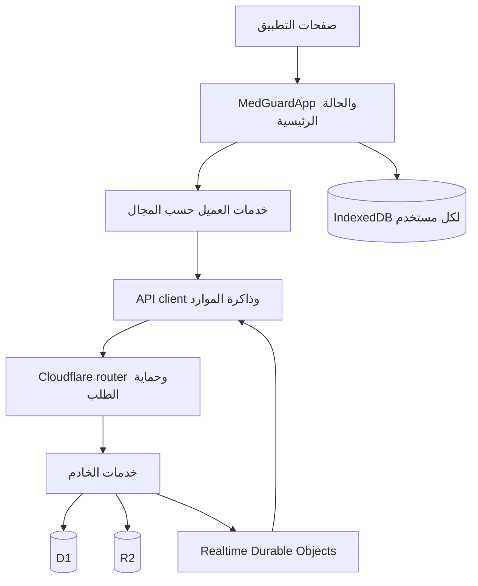

# مراجعة منطق Qraft استعدادًا للتعديل

تاريخ المراجعة: 5 أكتوبر 2026. النسخة: `app`، فرع `main`، الالتزام `b7d08eea8ed9cc1a09d2cba4a1c0e117021842d5`.

## النطاق والنتيجة

المشروع قابل للبناء، واجتازت اختباراته الحالية وفحوص الأنواع وlint واتساق المخطط. مع ذلك، أظهرت مراجعة المسارات وتجارب إضافية ثلاث نقاط تحتاج معالجة أو قرارًا صريحًا قبل العمل في المناطق المرتبطة بها: حماية المراجعة الحساسة، عزل استجابات إنشاء الاختبار عند تبديل الحساب، واعتماد أكثر من مقترح للسؤال نفسه في دفعة واحدة.

شملت المراجعة جرد المصدر، وربط مسارات الواجهة بالخدمات والخادم والتخزين، وقراءة المسارات الأساسية للمصادقة والصلاحيات والاختبارات والحفظ والمراجعة والاستيراد والاشتراكات والحذف والصور وRealtime وPWA. الجرد يضم 212 ملف مصدر ضمن `app/components/db/features/lib/server/workers`، بإجمالي 50,046 سطرًا، و53 ملف دخول لاختبارات Node، و35 ترحيل SQL. هذه أرقام نطاق المشروع؛ لا تعني تنفيذ كل تفاعل واجهة أو تدقيق كل سطر بنفس العمق.

`app/README.md` يحدد `app` بوصفها النسخة الأساسية. نسخة `release-classification` هي worktree منفصلة عند `dff18a8`، وتختلف الآن عن النسخة الأساسية. كان الكود المتتبع نظيفًا عند بدء المراجعة. المرجع الحاكم هو `QRAFT_ENGINEERING_CONSTITUTION.md`؛ التقارير القديمة تُستخدم للسياق وتُراجع مقابل المصدر.

لم أعدل منطق التطبيق، ولم أطبق ترحيلًا على قاعدة فعلية، ولم أنشر شيئًا. الإضافات هي هذه الوثيقة وملفات تجارب محلية تحت `.ui-review` المستثناة من Git.

## النتائج ذات الأولوية

### P1 — نوع التعديل المرسل من المساهم يتحكم في اشتراط المراجع الثاني

**الدليل:** `lib/cloudflare-server.ts:2109` يتحقق من اكتمال المقترح، لكنه لا يطابق `editKinds` مع التغيير الفعلي. `proposalRequiresTwoReviewers` مكررة في `lib/cloudflare-server.ts:2132` و`lib/platform-server.ts:310`، وتقرر الحساسية من تلك الوسوم. تغيير الإجابة يحتاج الوسم `correct_answer` حتى يُصنف هنا بوصفه حساسًا. وجود `typo_formatting` يستثني أيضًا بعض تغييرات النص والخيارات.

**التجربة:** عبر API التطبيق مع Miniflare وقاعدة مؤقتة وجميع الترحيلات، أُنشئ مقترح يغير الإجابة من الخيار 0 إلى 1، مع `editKinds: ['typo_formatting']`. قبله الخادم، ثم اعتمده مراجع مستقل واحد. كانت النتيجة `200`، والإجابة المنشورة 1، وعدد المراجعات 1، و`awaitingSecondReview: 0`.

هذا لا يتجاوز اشتراط وجود مراجع مستقل أصلًا؛ يتجاوز شرط المراجع الثاني للتغيير الحساس. يمكن كذلك أن يخطئ المستخدم في اختيار الوسم داخل نموذج التعديل العادي، لأن اختيار الوسوم وتغيير الإجابة عمليتان منفصلتان في الواجهة.

**الأثر:** حماية المراجعة الطبية تعتمد على وصف المساهم لتعديله. كذلك تستخدم حسابات مكافآت المساهمة الوسوم، فيجب مراجعة سلامة احتسابها عند معالجة هذه النقطة.

**الاتجاه المقترح:** يستنتج الخادم تغييرات الإجابة والخيارات والنص من المحتوى المعتمد أو نسخة الأساس الموثوقة. يبقى وصف المساهم للعرض والتفسير، وتحدد القواعد الموثوقة الحساسية. يلزم تحديد معيار واضح لما يعد تعديل تنسيق فقط، ثم اختبار الوسوم الناقصة والمضللة والمركبة ومساري الاعتماد الحاليين.

### P1 — إنشاء الاختبار لا يحمي الحالة من استجابة حساب سابق

**الدليل:** `components/medguard-app.tsx:7017` ينشئ callback يحتفظ بـ`user` و`state`. بعد انتظار `saveCloudState`، يكتب `stateSnapshot` ويستدعي `setStateRaw` عند السطر 7047 دون مقارنة هوية جلسة الحساب. ثم يختار الأسئلة ويسجل الاختبار ويتنقل إليه. بخلاف `manualSync` و`flushCloudState` و`checkpointPersonalState`، لا يستخدم هذا المسار `PersonalStateReceipt` أو تحققًا مكافئًا.

`features/exams/client/exam-client.ts` يرسل تسجيل بدء الاختبار دون `expectedUserId`، وكذلك طلب تجمع الأسئلة في هذا المسار، بينما الحفظ الشخصي في outbox يستخدم هذا الحاجز.

**التجربة:** استُخرج callback الفعلي بواسطة TypeScript AST، بالطريقة المستخدمة في اختبارات إيصالات الحفظ الموجودة. أُخر رد الحفظ، واستُبدلت الحالة المعروضة بحالة حساب B، ثم وصل رد حساب A. طبقت الدالة حالة A، واختفت ملاحظة B من الحالة، واستمر الانتقال إلى شاشة الاختبار.

**حد الإثبات:** هذا اختبار تنفيذ للدالة مع بدائل I/O، وليس اختبار تبديل حسابات في متصفح. كانت الكتابة المحلية المباشرة المسجلة في التجربة تخص A؛ لم تثبت التجربة حفظ بيانات A في تخزين B. إعادة حفظ الحالة بواسطة effects الخاصة بالحساب الجديد خطر مستنتج يحتاج اختبار تكامل واجهة.

**الاتجاه المقترح:** تثبيت هوية جلسة عند بدء العملية، والتحقق منها بعد الانتظارات وقبل تعديل الحالة أو التنقل. تقييد طلبات الاختبار بالحساب المتوقع، وحماية التعديلات الشخصية التي تحدث أثناء انتظار الرد أيضًا. انتهاء حفظ A يمكن أن يكون صحيحًا، لكن تطبيق رده على واجهة B يجب منعه.

### P2 — اعتماد مقترحين للسؤال نفسه في دفعة واحدة يستخدم إصدار الأساس نفسه

**الدليل:** `/platform/bulk-review` يقرأ الأسئلة مرة واحدة في `lib/platform-server.ts:1989`، ويستخدم الخريطة نفسها لكل مقترح. كل تعديل يحسب `revision: existing.revision + 1` عند السطر 2088، ثم يستبدل سجل السؤال عند السطر 2099. لا يُرفض تكرار `questionId` بين مقترحات التعديل، ولا تُحدث نسخة السؤال في الخريطة بعد معالجة المقترح الأول.

**التجربة:** سؤال بإصدار 1، ومقترحان معلقان له: الأول يغير النص، والثاني يغير الشرح ويحمل النص القديم. أُرسلا للاعتماد في الطلب نفسه. أعاد الخادم `reviewed: 2`، وصار كلا المقترحين `approved`، لكن السؤال النهائي كان بإصدار 2 ويحمل النص القديم وشرح المقترح الثاني. ترتيب المعالجة الحالي مصدره نتيجة القراءة، وليس عقدًا صريحًا يختار المستخدم به ترتيب تطبيق المقترحات.

**التمييز عن سياسة المنتج:** استبدال المحتوى كاملًا عند قبول مقترح قديم سلوك معتمد ومختبر، كما توضح السياسة أدناه. النقطة هنا هي تجميع تعديلين لهوية سؤال واحدة مع استخدام نسخة أساس واحدة وإصدار واحد، وإظهار نجاح كليهما دون توضيح النتيجة المتعارضة.

**الاتجاه المقترح:** أبسط خيار هو رفض دفعة تحوي أكثر من تعديل للسؤال نفسه وطلب مراجعتها منفردة. البديل يتطلب ترتيبًا معلنًا، وتحديث النسخة داخل المعالجة، وسياسة واضحة للاستبدال؛ لا ينبغي دمج المحتوى تلقائيًا دون قرار منتج. يلزم أيضًا فحص سباق الاعتماد مع تعديل السؤال أو المقترح أثناء الطلب؛ حارس التعاون العام ليس موجودًا تلقائيًا في كل endpoint مستقل.

## البنية الفعلية وحدود المسؤوليات

| المنطقة | المسؤولية الحالية | أثر تعديلها |
|---|---|---|
| `app/*/page.tsx` و`app/qraft-route.tsx` | مداخل المسارات وتحديد الشاشة أو البنك أو الاختبار | الروابط المباشرة، إعادة التحميل، العودة والتنقل |
| `components/medguard-app.tsx`، 7,771 سطرًا | ملكية الحالة، الجلسة، الدمج، الدراسة، الحفظ والتنقل | أعلى نطاق ترابط في العميل |
| `features/*/domain` | قواعد وصيغ قابلة للاختبار مثل الوصول والتكرار والتقدم | تغيير معناها يمتد إلى جميع المستهلكين |
| `features/*/client` | طلبات المجالات، outbox وإيصالات الحفظ | توقيت الشبكة، التعارض والتعافي |
| `server/api/*` و`server/http/*` | توزيع الطلبات، الهوية المتوقعة، الأصل، الحدود والأخطاء | الحماية المشتركة لجميع APIs |
| `lib/cloudflare-server.ts`، 3,666 سطرًا | المصادقة، الحالة الشخصية، قراءة التعاون والتحقق من تغييره، الصور | حدود الثقة والحفظ الذري |
| `lib/platform-server.ts`، 3,144 سطرًا | المراجعة والاستيراد والتكرار والاشتراكات وعمليات المنصة | أثر متعدد المجالات، مع endpoints لها معاملات مستقلة |
| `lib/preformed-test-server.ts` | إنشاء الاختبار الجاهز ونشره والمشاركة والتصحيح | إصدار المحتوى، خصوصية المشارك والتسليم |
| `db/schema.ts` و`drizzle` | الجداول والترحيلات والقيود وtriggers | جزء من منطق التطبيق، وليس تعريف تخزين فقط |
| `worker.ts` و`workers/realtime.ts` | تشغيل التطبيق، إشعارات التغيير والأعمال المجدولة | النشر والتعافي وتنظيف السجلات والملفات |

فصل المجالات موجود، لكنه جزئي. بعض ملفات `features/*/server` تعيد تصدير تنفيذ من الملفات الكبيرة في `lib`. نقل import إلى مجلد مجال لا يعني أن مسؤولية التنفيذ انفصلت فعليًا. أي فصل لاحق يجب أن يتبع مسار عمل كاملًا ويحافظ على الواجهات المتوافقة.

المسارات تغطي الدراسة، البنوك، إنشاء الاختبارات ومراجعتها، التاريخ والتقدم، البطاقات، الاختبارات الجاهزة، المساهمات والمراجعة، الحساب والاشتراك والدعم، الإعدادات والإدارة والوصول، وشاشة انقطاع الاتصال. تتجمع أغلبها في الجذر نفسه بدل امتلاك حالات مستقلة لكل صفحة.

## ملكية البيانات والقواعد التي يجب حفظها

| الكيان | مصدر الحقيقة والتخزين | القاعدة الحساسة |
|---|---|---|
| محتوى السؤال | `records/sharedQuestions` | محتوى مشترك، منفصل عن تقدم الطالب |
| الحالة الشخصية | `AppState` محليًا، ثم `app_states` في D1 | لقطة شخصية كبيرة تشمل الاختبارات والتقدم والبطاقات والإعدادات |
| التعاون | سجلات `records` حسب النوع والبنك، مع نسخة محلية خاصة بالمستخدم | فروقات سجلات وإصدارات وتحقق صلاحيات |
| السؤال المقترح | `questionProposals` وسجل المراجعات | لا ينشر مساهم عادي محتوى معتمدًا مباشرة |
| الاختبار الجاهز | جداول `preformed_*` و`questions_json` | محتوى مستقل وإصدار، مع تصحيح خادمي |
| الاستحقاق | الاشتراك والمكافآت والمنح وتجاوزات الإدارة وأجيال الوصول | الدور والخطة مفهومان مختلفان |
| الصور | `media` في D1 والمحتوى في R2 | تحقق الوصول عند القراءة، وتنظيف بعد تثبيت الحذف |
| الهوية | `profiles/sessions` | الدور والحظر والتحقق يأتيان من الخادم |

هناك ثلاثة معرّفات مختلفة للسؤال: `id` للربط الداخلي، و`questionId` لرقم العرض المحجوز، و`number` للترتيب. الاختبارات والتقدم والملاحظات والمقترحات مرتبطة بالهوية الداخلية؛ تبديل تلك المعاني يفسد المراجع.

وجود 217 سؤالًا في `data/questions.json` لا يعني أنها تُضاف الآن في العميل عند كل فتح. المسار الحالي يجمع الأسئلة الشخصية والمنشورة وبيانات تجمع الاختبار، ويطبق `questionOverrides` الشخصية. يجب فحص البيانات القديمة التي تحمل overrides قبل أي تغيير في أولوية المحتوى.

triggers تنفذ ضمانات الهوية والحذف والمراجعات والمزامنة والفهارس. لذلك لا تكفي مراجعة دوال TypeScript لإثبات صحة عملية تتغير معها علاقات البيانات؛ يجب تتبع SQL الذي يعمل داخل المعاملة أيضًا.

## الدراسة والتقدم والبطاقات

إنشاء اختبار مخصص يحفظ الحالة اللازمة، ويطلب الاختيار من `/platform/test-pool`، ويسجل البداية عبر `/platform/exam-start`. الخادم يفحص الوصول والعدد وحصة الاختبارات. التنقل داخل الأسئلة والإجابات والعرض محلي بعد تحميل البيانات.

`gradeCurrent` يحسب النتيجة ويزيد عدادات المحاولة، ويضيف السؤال إلى `graded` لمنع التصحيح المعتاد المتكرر. إعادة المحاولة تزيل هذا المنع عمدًا. `completeTest` يصحح الإجابات التي لم تصحح بعد. إحصاء الاختيارات المشتركة في الواجهة يحتفظ باختيار المستخدم الأول الموجود، بينما عدادات التقدم الشخصي تمثل محاولاته.

**أثر مهم على التاريخ:** `TestSession` تحفظ معرفات الأسئلة والإجابات ولا تحفظ نسخة السؤال أو مفتاحه وقت البداية. كما أن `summarizeProgress` يقارن `lastAnswer` بمفتاح السؤال الحالي. لذا تعديل مفتاح الإجابة أو التصنيف أو حذف السؤال قد يغير نتيجة العرض والتقدم دون محاولة جديدة. هذا اختلاف بين الأداء التاريخي والمقارنة بالمحتوى الحالي؛ يلزم تحديد المقصود قبل إضافة snapshots أو تغيير حساب النتائج.

الاختبارات الجاهزة تختلف: المحتوى محفوظ في `questions_json`، وتتغير نسخته عند تغييرات ذات صلة. وضع exam يخفي الإجابات قبل التسليم، ويصحح الخادم الأجوبة باستخدام رمز المحاولة وإيصال التسليم. لا ينبغي نقل افتراضات الاختبار المخصص إلى هذا المسار.

بطاقات المراجعة تحفظ محتوى مستقلًا ومرجع `sourceQuestionId` اختياريًا؛ المرجع لا يجعل البطاقة نسخة حية تتحدث تلقائيًا مع السؤال. جدولة FSRS وسجل المراجعة بيانات شخصية. إنشاء/تعديل البطاقات له حفظ مستقل، بينما تقييم المراجعة يعتمد على checkpoint. استيراد Anki يشمل فك الملف وSQLite وصورًا؛ يعد مسارًا مختلفًا عن استيراد الأسئلة.

## الحفظ والتعارض والتعافي

الحالة الشخصية تحفظ في IndexedDB بمفتاح الحساب، عادة بعد 200ms، وبزمن أقصر داخل الدراسة. الحفظ السحابي يستخدم `operationId` و`baseRevision` وطابورًا محليًا قبل الإرسال. قفل Web Locks ينسق التبويبات عند توفره، والبديل ينسق داخل التبويب، مع حماية إصدار خادمية. تأكيد طلب سابق لا يجب أن يمسح تعديلًا أحدث أو يؤثر في حساب آخر؛ هذا ما تعالجه إيصالات الحفظ في المسارات التي تستخدمها.

**سياسة قائمة وليست دمج حقول:** `mergeAppStates` يختار أحدث لقطة كاملة، ويرجح الخادم عند التعادل. تعديل على جهازين يمكن أن يحسم لصالح إحداهما ويستبعد بيانات موجودة فقط في الأخرى. Timestamp العميل عنصر مؤثر، فلا يجوز وصف هذا المسار بأنه دمج مستقل للإجابات أو ضمان الاحتفاظ بجميع تعديلات الجهازين. أي تحسين يحتاج قرارًا واضحًا حول ملكية الحقول والحذف والتعارض.

الحفظ الجزئي يعيد بناء الحالة الخادمية ثم يمررها إلى تحقق الحفظ العام. حفظ الإجابات الشخصية والإحصاءات المشتركة يحدث في مرحلتين؛ فشل المرحلة الثانية يعيد خطأ، وتساعد هوية العملية على إعادة المحاولة دون تكرار الحالة الشخصية. يظل سيناريو حذف السؤال أو سحب الوصول بين المرحلتين مهمًا لأي تعديل هنا.

مزامنة التعاون تختلف: تقارن النسخة المحلية بالنسخة المؤكدة، وتنتج عمليات للسجلات، وتقسمها حسب البنك. السجل المتوقع أو تجزئته يمنع الكتابة فوق تغيير آخر، و`collaboration_write_guard` يتحقق من اللقطات داخل دفعة D1 التي تنفذ الكتابات. الإحصاءات تسمح بتعديل اختيار المستخدم نفسه مع الحفاظ على الآخرين.

التغييرات المرفوضة تحفظ كمسودات قابلة للتنزيل. delta التعاون تستخدم journal وحدًا أقصى للنافذة وتوقيع نطاق مرتبطًا بالصلاحيات؛ تُستخدم لقطة كاملة عند تغير النطاق أو تقادم cursor. النسخة المؤكدة وcursor يحفظان معًا، منفصلين عن المسودات.

حد الحالة الشخصية الانتقالي 1,500,000 بايت، مع تحذير عند 1,200,000. عدد البطاقات أو الاختبارات وحده لا يضمن إمكان حفظها؛ حجم المحتوى والسجل مؤثر. العميل يرفض الحالة الزائدة، بينما الخادم يسمح ببعض الحالات القديمة الكبيرة بشرط عدم زيادة حجمها. هذا اختلاف يجب اختباره إذا كان التعديل يتعلق باستعادة بيانات قديمة أو تقليل حجمها.

## الصلاحيات والحسابات والاشتراكات

Cookie الجلسة HttpOnly وSecure، والتخزين يحتفظ بتجزئة رمزها. `currentUser` يتحقق من الجلسة والحظر والتحقق المطلوب ويشتق الاستحقاق الفعلي. جلسة المسؤول غير الموثقة يمكنها اكتشاف الحاجة إلى MFA، وتحتاج APIs المحمية إلى التحقق المناسب.

`access-policy.ts` يفرق بين الوصول والإدارة والتحرير والمراجعة والحذف. المراجع العام يراجع البنك العام؛ البنك الخاص يحتاج ملكية أو دورًا مناسبًا داخله، مع استثناء المسؤول الأعلى. إخفاء زر في الواجهة ليس تصريحًا.

صلاحيات Superadmin الاستثنائية مقصودة: منها فحص البنوك الخاصة وتعديل السؤال مباشرة وبعض حدود الاستيراد المختلفة. لا تصنف كخلل لمجرد أنها غير متاحة للطالب. السياسة في `docs/SUPERADMIN_QUESTION_EDIT_2026-09-27.ar.md` تقرر صراحة أن قبول مقترح قديم يستبدل محتوى السؤال حتى بعد تعديل إداري مباشر؛ ويختبر المشروع ذلك. تغيير هذه القاعدة يتطلب قرار منتج.

الخطة الفعلية لا تعتمد على `tier` الخام وحده. تجمع مصادر الوصول، مع تجاوز إداري، وأجيال تمنع عودة منح قديمة بعد سحب الوصول. هدية جديدة يمكنها منح وصول جديد بعد السحب. إشعار الهدية يستخدم claim ذريًا لضمان عرض واحد عبر الأجهزة، وهذه أولوية للعرض مرة واحدة وليست ضمانًا أن المستخدم شاهد النافذة بعد فقد الرد.

الموافقة التلقائية للتسجيل سياسة قابلة للإدارة ومؤطرة بإصدار، وتشمل الحسابات المؤهلة القائمة عند تفعيلها. فحص سياسات التسجيل أو حذف الهويات القديمة يجب أن يتضمن الحظر والرقم الجامعي والسجلات التاريخية والتصويت المستقل.

## الاستيراد والتكرار والمراجعة

المسار يقرأ ويصلح JSON عند الحاجة، ويطبع المصدر والحقول، ويعرض نتائج العناصر، ويستخدم دفعات مع هوية طلب ثابتة. حدود الطالب العادي تصل إلى 150 سؤالًا للدفعة مع حدود حسابه؛ المسار الإداري الصريح يسمح حتى 250. توجد حدود يومية وتعليق الاستيراد وتتبع التشغيل والدفعات.

فحص التكرار مقيد بالبنك، ويستخدم مفاتيح النص والمحتوى وFTS ومرشحين محدودين، مع revision للفهرس وحارس داخل معاملة الاستيراد. التطابق الكامل والاشتباه بالتكرار وقرار المراجع مفاهيم مختلفة. تطبيع التكرار يحافظ على الفروق الحساسة في الأرقام والعلامات والاتجاهات والنفي؛ تغييره قد يبدل معنى الحالات الطبية.

اعتماد المقترح يربط النشر بالمراجعة والمكافأة والتصنيف والفهارس والتدقيق. حماية التكرار وإعادة المحاولة عبر claims تمنع آثارًا مكررة، لكنها لا تعوض التحقق من اختلاف محتوى المقترح أو التعامل مع مقترحين للسؤال نفسه؛ النتائج السابقة تكشف هذا الفرق.

## الحذف والملفات والدعم

حذف البنك يثبت tombstone ثم يزيل السجلات التابعة ويميز الصور للتنظيف ضمن D1. المحتوى الخارجي يحذف لاحقًا بتوازٍ محدود وإعادة محاولة. تحديث العداد وحذف metadata مترابطان لمنع طرح حجم التخزين مرتين. لا يجوز تحويل هذا المسار إلى حذف ملفات خارجي سابق لحفظ قرار الحذف.

حذف الحساب يعيد نسب المحتوى المشترك إلى Deleted user، ويحافظ على استقلال سجلات المراجعات التاريخية، ويحذف البنوك الخاصة غير المشتركة وفق السياسة. يتحقق من snapshot للبيانات المشتركة لتفادي حذف شيء تغير أثناء العملية. `cleanDeletedState` يزيل أو يعدل مراجع الأسئلة المتقاعدة، ويؤثر بذلك في الاختبارات الشخصية القائمة والتاريخ.

الدعم يتحقق من ملكية التذكرة أو صلاحية المسؤول الأعلى، ويستخدم قراءة محدودة للقوائم والرسائل. تغيير ربط التذكرة بالسؤال يجب أن يحافظ على UUID المستقر وسلوك السؤال المحذوف.

R2 خلف adapter، مع حصص تقنية ومصادقة لقراءة المحتوى الخاص. ما زالت سجلات ImageKit القديمة تدعم التوافق والتنظيف. النسخ الاحتياطي للأسئلة مسار مجدول مستقل؛ نجاح بنائه لا يثبت أن استعادة نسخة إنتاج اختبرت عمليًا.

## الشبكة وRealtime وPWA والأداء

ذاكرة الموارد تشارك القراءة المتطابقة، وتربط المفاتيح بالنطاق والطلب، وتبطل tags عند التغيير. لا يوجد TTL عام؛ إعادة فتح الصفحة لا تعني أن البيانات تغيرت. Realtime يحمل إشعارات لا محتوى خاصًا، ويتحقق التطبيق من الجمهور قبل فتح القناة، ثم يعيد قراءة البيانات المحمية عند الحاجة. فقد الإشعار أثناء اتصال قائم دون انقطاع يظل سيناريو مختلفًا عن التعافي بعد reconnect.

عدد القنوات ينمو مع البنوك وأدوار المراجعة، والحالة المشتركة ما زالت تجمع عدة مجموعات في العميل. التصنيف الدقيق لقراءة الخادم وdelta يقلل العمل، لكنه لا يثبت وحده قدرة جلسة تضم آلاف البنوك أو الأسئلة. لا توجد في هذه المراجعة قياسات إنتاج أو ادعاء سعة.

Service Worker يستثني `/api/` وملفات التطوير، ويخزن موارد الواجهة ويستخدم `/offline` عند تعذر التنقل. الإصدار الحالي `qraft-shell-v4.7.10`. تحديث PWA وتوافق العملاء القدامى يجب أن يظلا ضمن اختبار أي تغيير عقد API أو حفظ.

البناء الحالي أصدر تحذير حجم chunk. حزمة `medguard-app` المقيسة محليًا نحو **883 KiB** بعد minification وقبل ضغط النقل. الحجم ينسجم مع تجميع شاشات ومجالات كثيرة في الجذر، وهو سبب عملي لدراسة تحميل الشاشات الثقيلة عند الطلب. هذه قراءة لحجم ملف؛ لا تعادل قياس زمن بدء على هاتف أو شبكة فعلية.

## خريطة التعديل الآمن

| نوع التعديل | ما يجب ربطه | تحقق مركز مناسب |
|---|---|---|
| إضافة حقل شخصي | النوع، الابتدائي وnormalize، المحلي، payload الحفظ الكامل والجزئي، الخادم والدمج | حسابان، رد متأخر، انقطاع الشبكة وتعارض إصدار |
| تعديل الدراسة أو النتائج | الجلسة، grading، إحصاءات المستخدم، التقدم، التاريخ وحذف السؤال | إعادة المحاولة، إنهاء جزئي، تغير المفتاح أثناء الدراسة |
| مراجعة السؤال | المقترح، الفروق الفعلية، المراجعين، revision، النشر والتصنيف والمكافأة | وسم مضلل، اعتمادان للسؤال نفسه، تعديل أثناء الاعتماد |
| صلاحيات أو اشتراك | القاعدة المشتركة، تحقق الخادم، الاستحقاق وأجياله، cache وcursor وقنوات الجمهور | وصول خاص، سحب الوصول، هدية جديدة، جلسة قديمة |
| استيراد | parser والمعاينة، الحدود، هوية الطلب، فهرس التكرار والنتائج | جزء غير صالح، رد مفقود، replay، تغير الفهرس |
| حذف | الهوية والمراجع، البيانات الشخصية، الصور والعدادات وtombstone والتدقيق | rollback، تكرار الطلب، فشل التخزين الخارجي |
| مخطط قاعدة البيانات | تعريف Drizzle، SQL المراجع، قائمة SQL-managed objects وتوافق النسخ | فحص المخطط والترحيلات واختبار السلوك الذري |
| عرض أو أداء | ownership للحالة، المسار، المحمول وPWA، أسباب الطلب والإبطال | التنقل دون طلب زائد، حفظ المسودة، قياس قبل وبعد |

ترتيب مناسب للتحضير العملي: معالجة حدود الثقة وعزل الحساب أولًا، ثم حسم اعتماد المقترحات المتعارضة، ثم إجراء التعديل المطلوب في نطاقه. تفكيك الملفات الكبيرة يمكن تنفيذه لاحقًا على وحدات وظيفية صغيرة؛ لا حاجة لإعادة كتابة شاملة لمجرد حجم الملفات.

## أدلة التحقق وحدوده

| الفحص | النتيجة |
|---|---|
| `node --test --test-reporter=dot tests/*.test.mjs` | اكتمل برمز خروج 0 لجميع ملفات الدخول الحالية |
| `tsc --noEmit --incremental false` | نجح دون أخطاء |
| `oxlint` | نجح دون أخطاء |
| `node scripts/database-schema.mjs check` | `ok: true`، 61 جدولًا و31 trigger مدارة بواسطة SQL، بلا أخطاء |
| `npm run build` | نجح؛ تحذير حجم chunk وتصنيف بعض المسارات بواسطة vinext |
| تجربة API إضافية | أثبتت اعتماد تغيير إجابة موسوم كتنسيق بمراجع واحد، وحالة دفعة المقترحين |
| تجربة callback إضافية | أثبتت تطبيق رد إنشاء اختبار سابق على حالة مستبدلة، مع I/O بديلة |

ملفات التجارب: `.ui-review/deep-review-probe.mjs` و`.ui-review/deep-review-probe-results.json`، و`.ui-review/deep-review-client-probe.mjs` و`.ui-review/deep-review-client-probe-results.json`. تستخدم التجربة الأولى قواعد محلية مؤقتة بلا persistence أو موارد إنتاج؛ الثانية لا تستخدم شبكة أو قاعدة فعلية.

التشغيل الأول للاختبارات والأنواع وlint تعطل قبل تحميل المصدر بسبب `EPERM` على مسار Windows. أعيد التشغيل خارج ذلك العزل ونجح؛ لا تعد أخطاء التشغيل الأول إخفاقات في منطق التطبيق.

الاختبارات الحالية مزيج من فحوص بنية المصدر، واختبارات مجال، واختبارات APIs وقاعدة محلية. نجاحها لا يثبت السلوك غير المغطى، كما بينت التجارب الجديدة. لم يُجر فحص واجهة في المتصفح أو جهاز iPhone/iPad، أو اختبار staging/إنتاج، أو استعادة backup فعلية، أو تدقيق صحة المحتوى الطبي، أو فحص حديث لثغرات الاعتماديات الخارجية. الجاهزية المثبتة هنا هي البناء والتحقق المحلي وفهم المسارات، وليست شهادة خلو من العيوب.
