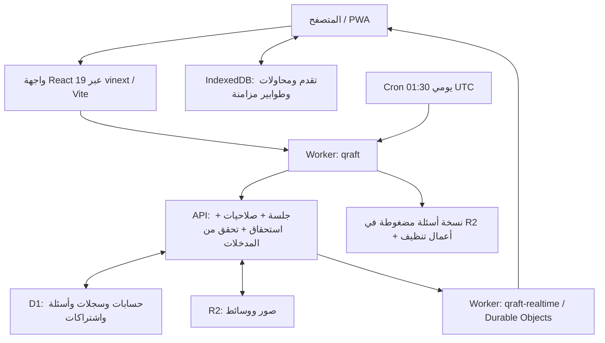

# تقرير جاهزية Qraft للإطلاق كمنتج SaaS للأفراد

**تاريخ الفحص:** 23–24 سبتمبر 2026، بتوقيت السعودية.  
**النطاق المتفق عليه:** أول 100 عميل فردي، بالباقات الموجودة في المشروع.  
**النسخة المنشورة:** [Qraft](https://qraft.eduhelp.workers.dev/).  
**المصدر المحلي:** `C:/Users/Khaled/Desktop/Medguard/app`، مع تغييرات غير ملتزم بها فوق commit `5d1d3dfd282fec0108247ba97f2b8e0e8094d22f`.

## 1. القرار التنفيذي

**التطبيق يمتلك أساسًا تقنيًا جيدًا لإطلاق محدود يخدم 100 عميل، لكن لا أوصي بإطلاق تجاري مفتوح بالحالة الحالية.** توجد وظائف حقيقية مكتملة واختبارات معتبرة، إلا أن بعض حدود الباقات لا تتفق مع التنفيذ، وهناك ثغرات في دورة حياة البيانات المحلية وحذف الحساب، إضافة إلى فجوات في إدارة الإصدارات والتعافي التشغيلي.

القرار المناسب هو **إطلاق تجريبي مدفوع بإدارة يدوية بعد إغلاق العوائق المحددة أدناه**، ثم الانتقال إلى إطلاق عام بعد التحقق من التحمل والاستعادة ورحلة العميل كاملة. عدد 100 حساب مسجل وحده ليس مشكلة بنيوية ظاهرة؛ أما تحمل 100 مستخدم متزامن فلم يثبت باختبار ضغط في هذه المراجعة.

| مجال التقييم | الحكم | السبب المختصر |
|---|---|---|
| الدراسة والأسئلة والمساهمات والمراجعة | أساس جاهز لتجربة محدودة | الوظائف موجودة وتغطيها اختبارات سلوكية |
| مصادقة الخادم والصلاحيات | جيد مع استكمال جوانب دورة الحساب | جلسات محمية، MFA للإدارة، وعزل API؛ استعادة الحساب غير مكتملة |
| الخصوصية على الأجهزة المشتركة | يحتاج إصلاحًا قبل التوسع | محاولات الاختبارات الجاهزة محفوظة دون فصل حسب المستخدم |
| الباقات والاستحقاقات | يحتاج تصحيحًا قبل البيع حسب الحدود المعلنة | Unlimited يعرّف 20,000 بطاقة بينما الحفظ يرفض أكثر من 5,000 |
| الدفع والتحصيل | مناسب لخدمة يدوية فقط | واتساب ثم تفعيل إداري؛ لا بوابة دفع آلية في المسار الحالي |
| سلامة قاعدة الإنتاج | النتائج المحددة مطمئنة | لا مخالفات في العلاقات التي فُحصت؛ ترحيل محلي أخير غير مطبق |
| النشر والتعافي والمراقبة | غير مكتمل الإثبات | لا بيئة staging أو CI ظاهرة بالمستودع، ولا تجربة استعادة موثقة ومتحقق منها |
| الملاءمة لـ100 عميل | ممكنة بشروط | يلزم قياس الحمل وحجم بيانات المستخدم ومعالجة حدود IP المشتركة |

لا أعطي نسبة جاهزية رقمية؛ نجاح الاختبارات لا يساوي اكتمال المنتج أو ضمان الخصوصية أو تحمل الحمل.

## 2. ما الذي تمت مراجعته فعلًا؟

راجعت مسارات المصادقة والصلاحيات والباقات والتعاون والاختبارات والمزامنة والوسائط وحذف الحساب والنسخ الاحتياطي، ومخطط Drizzle وترحيلات SQL وإعدادات Worker وD1 وR2 وDurable Objects. شغّلت الاختبارات والبناء وعمليات dry-run محليًا، وفحصت الصفحة العامة ونموذج التسجيل في المتصفح دون إرسال تسجيل جديد.

استخدمت Wrangler لقراءة معلومات قاعدة الإنتاج، وأسماء الأسرار، وسجل الترحيلات، وأعداد وأحجام مجمعة، وروابط السياسات، وسجل النشر. جميع الاستعلامات المقصودة كانت للقراءة؛ أظهرت استعلامات التحقق **صفر صفوف مكتوبة**. لم أنشر تغييرات، ولم أطبق ترحيلًا على الإنتاج، ولم أعدّل كود التطبيق. الملفات الجديدة تخص التقرير وأدلة المراجعة فقط.

التقرير يميز بين:

- **متحقق بالتشغيل:** اختبار محلي أو استجابة مباشرة من النسخة المنشورة أو قاعدة الإنتاج.
- **مثبت بمراجعة الكود:** مسار برمجي واضح، دون الادعاء بأنه أُعيد إنتاجه على بيانات عملاء.
- **غير متحقق:** يحتاج وصولًا أو تجربة إضافية؛ عدم التحقق لا يعني عدم وجوده.

المراجعات القديمة داخل `docs/phase-4` مفيدة للسياق، لكنها ليست بديلًا عن نتائج هذه المراجعة. مثال: وجود `BACKUP_SIGNING_KEY` كان غير متحقق في تقرير سابق؛ تحققت هذه المرة من وجود اسمه ضمن أسرار الإنتاج، دون قراءة قيمته أو التحقق من قوته.

## 3. كيف يعمل التطبيق مع Cloudflare؟

**الواجهة:** React وTypeScript وTailwind، مع مسارات شبيهة بـNext.js يشغّلها vinext. الجزء الرئيسي من حالة الواجهة والتنقل ما زال داخل `components/medguard-app.tsx`، وحجمه 7,720 سطرًا وقت الفحص. التشغيل ليس مبنيًا على خادم Next.js تقليدي أو Cloudflare Pages.

**الخادم:** `worker.ts` يستقبل الطلبات ويضيف ترويسات الأمان، ويمرر WebSocket إلى مسار مستقل. `server/api/cloudflare-router.ts` يوزع طلبات API على الخدمات. حدود `features/*/server` موجودة، لكن جزءًا كبيرًا منها يعيد تصدير التنفيذ من ملفين كبيرين: `lib/cloudflare-server.ts` بنحو 3,535 سطرًا و`lib/platform-server.ts` بنحو 3,056 سطرًا. هذا فصل واجهات مفيد، لكن الفصل الداخلي للمسؤوليات لم يكتمل.

**المصادقة:** كلمات المرور مشتقة باستخدام PBKDF2 مع salt؛ رموز الجلسات عشوائية ويُحفظ hash لها في D1. Cookie الجلسة يستخدم `__Host-` و`HttpOnly` و`Secure` و`SameSite=Lax`. جلسة تمهيد الإدارة قصيرة وغير موثقة بـMFA، ثم يدور رمز الجلسة بعد التحقق. الصلاحيات لا تعتمد على إخفاء أزرار الواجهة فقط.

**الاستحقاقات:** الخادم يحسب الباقة الفعلية من الاشتراك والمكافآت والمنح الإدارية وoverride الإداري. توجد حدود للاختبارات والاستيراد والبطاقات، مع قيود في SQL لحماية عمليات حساسة من التكرار والتزامن.

**المزامنة:** IndexedDB يحتفظ بالبيانات وطوابير الإرسال؛ الخادم يستخدم revisions وoperation IDs لمعالجة إعادة المحاولة وتعارض النسخ. إشعارات Durable Objects تخبر العميل بأن موردًا تغير، ثم يعيد العميل جلبه من API المحمي؛ لا ترسل محتوى الأسئلة عبر WebSocket.

**الوسائط:** رفع الصور وجلبها يمر عبر خدمة R2 وفحص صلاحية المورد. توجد حدود كلية للتخزين والعمليات. ما زال دعم ImageKit موجودًا للتعامل مع وسائط قديمة.

**الأعمال المجدولة:** cron يومي عند 01:30 UTC، أي 04:30 صباحًا بتوقيت السعودية، لإنشاء نسخة الأسئلة وتنظيف بعض بيانات العمليات وانتهاء الاشتراكات. وجود الإعداد في المستودع لا يثبت وحده نجاح كل تشغيل يومي.

Cloudflare ملائم لهذه البنية ولهذا الحجم المبدئي. لا توجد أدلة هنا تستدعي نقل المشروع إلى منصة أخرى قبل إطلاق 100 عميل. الأهم هو ضبط استخدام D1، وفصل بيانات المستخدم الكبيرة، وتثبيت دورة النشر والاستعادة.

## 4. صورة قاعدة البيانات والإنتاج

### نتائج مباشرة وقت الفحص

| المؤشر | القيمة |
|---|---:|
| عدد الجداول كما أبلغت D1 | 47 |
| حجم قاعدة الإنتاج | 12,742,656 بايت، نحو 12.74 MB |
| صفوف profiles، وليست بالضرورة عملاء مدفوعين | 10 |
| الأسئلة المشتركة | 1,124 |
| بنوك الأسئلة | 3 |
| سجلات حالة المستخدم | 7 |
| أكبر حالة مستخدم محفوظة | 39,008 بايت |
| جلسات منتهية ما زالت مخزنة | 34 |
| مخالفات foreign keys | 0 |
| أسئلة دون registry / registry دون سؤال | 0 / 0 |
| سجلات مرتبطة ببنك مفقود وفق الاستعلام المحدد | 0 |
| عضويات لحسابات مفقودة / عضويات مكررة | 0 / 0 |
| اشتراكات نشطة انتهى تاريخها ولم تنتقل حالتها | 0 |
| مجموع أحجام وسائط R2 المسجلة / عداد التخزين | 33,959 / 33,959 بايت |
| موقع تشغيل D1 | WEUR، وظهرت AMS في نتائج الاستعلام |
| Read Replication | معطل |

هذه فحوص علاقات وأحجام محددة، وليست إثباتًا لكل قواعد العمل أو جودة محتوى الأسئلة. لم أستخرج بيانات العملاء الشخصية أو كلمات المرور أو قيم الأسرار.

**المخطط المحلي:** تطبيق كل ملفات SQL على SQLite معزولة أنتج 48 جدول تطبيق و105 فهارس، بما فيها الفهارس التلقائية، و17 trigger؛ جميع أسماء الجداول الـ48 ممثلة في `db/schema.ts`، ونتيجة `integrity_check` كانت `ok`. طريقة عد الجداول المحلية ليست مطابقة بالضرورة لعدد الجداول الذي تعرضه خدمة D1.

**نمط البيانات:** الحسابات والجلسات والاشتراكات والاستيراد والاختبارات الجاهزة موزعة على جداول واضحة. في المقابل، جدول `records` يجمع أنواعًا متعددة في JSON، وجدول `app_states` يحتفظ بحالة كبيرة واحدة لكل مستخدم. هذا عملي للمرحلة الحالية، لكنه ينقل جزءًا مهمًا من التحقق والعلاقات إلى TypeScript وtriggers، ويجعل حجم JSON ومسارات القراءة الواسعة عاملين مؤثرين.

**الفارق بين المحلي والإنتاج:** المحلي يحتوي 24 ملف ترحيل من `0000` إلى `0023`؛ الإنتاج يسجل 23 ترحيلًا حتى `0022`. تحققت أيضًا من أن جدولي `json_import_runs` و`json_import_attempts` غير موجودين في الإنتاج. أحدث نشر ظاهر وقت القراءة كان 23 سبتمبر 2026 عند 14:44:27 UTC. لم أثبت أن شيفرة هذا النشر تطابق شجرة العمل الحالية.

**الاستهلاك خلال آخر 24 ساعة كما أبلغت D1 قبل فحوص التقرير:** 16,295 استعلام قراءة، و3,490 استعلام كتابة، و6,045,489 صفًا مقروءًا، و32,142 صفًا مكتوبًا. هذه حركة فعلية مختلطة قد تشمل الإدارة والاستيراد والاختبار، ولا يصح اعتبارها استهلاك عشرة عملاء طبيعيين أو ضربها مباشرة في عشرة لتقدير 100 عميل.

## 5. الاختبارات التي أُجريت

| الفحص | النتيجة | ما الذي تثبته؟ |
|---|---|---|
| `npm test` | 125 نتيجة ناجحة، صفر فشل | الاختبارات الحالية للوحدات والسياسات وAPI في بيئة محلية |
| `npm run lint` | نجاح | عدم وجود أخطاء وفق إعداد lint الحالي |
| TypeScript، دون emit | نجاح | سلامة الأنواع في الحالة المفحوصة |
| `npm run build` | نجاح مع تنبيه حجم bundle | إنتاج حزمة صالحة للبناء |
| dry-run للحزمة الرئيسية وrealtime | نجاح كلاهما | قدرة Wrangler على تجهيز الحزمتين دون نشر |
| اختبارات API على حزمة الإنتاج المحلية | 45 نتيجة ناجحة | توافق المسارات المختبرة مع البناء؛ تتداخل مع اختبارات المجموعة الأساسية |
| جميع migrations على SQLite معزولة | نجاح | قابلية إنشاء المخطط وتحقق العلاقات في fixture محلية |
| `tests/platform-database.test.py` | 9 اختبارات، منها 7 أخطاء | suite قديمة لا تتوافق fixtures فيها مع عدد الأعمدة الحالي |
| فحص تبعيات الإنتاج بـnpm audit | صفر ثغرات معروفة في النتيجة | لقطة قاعدة advisories وقت الفحص، وليست ضمانًا أمنيًا شاملًا |
| فحص جميع التبعيات | 4 تنبيهات متوسطة | سلسلة أدوات التطوير Drizzle/esbuild، وليست أربع ثغرات مستقلة في تطبيق الإنتاج |

فشل Python ناتج، مثلًا، عن إدخال 3 قيم في `test_registry` الذي أصبح 4 أعمدة، و11 قيمة في `discount_codes` الذي أصبح 12 عمودًا. هذا يدل على تقادم الاختبار؛ لا يثبت فساد قاعدة الإنتاج. هذا الملف غير مشمول بـ`npm test` الذي يشغل ملفات `.test.mjs`.

جزء من اختبارات الأمان يفحص نص الكود بنمط regex، إلى جانب اختبارات API سلوكية قوية. لذلك لا يكفي اجتيازها وحده لإثبات سلوك الأجهزة المشتركة أو جميع حالات الخصوصية.

جرى إعداد probe إضافي لحد البطاقات وحجم الحالة وحذف هوية لوحة الترتيب. انقطع تشغيله باتصال `ECONNRESET` داخل مشغل الاختبار قبل إنتاج نتائج مؤكدة، ثم تعذرت إعادة التشغيل بسبب بلوغ خدمة الموافقة التلقائية حد الاستخدام. **لا تُحتسب هذه probes كاختبارات ناجحة، والملاحظات المرتبطة بها أدناه موصوفة صراحة بأنها ناتجة من مراجعة الكود.**

### تحقق النسخة المنشورة

- الصفحة الرئيسية وصفحة الاشتراك والـmanifest وService Worker أعادت HTTP 200.
- جلسة زائر أعادت `{"user":null}`؛ الحالة الخاصة أعادت 401؛ التعاون وإدارة الاشتراكات أعادا 403 للزائر، مع `Cache-Control: no-store`.
- الصفحة المنشورة ترسل CSP وHSTS و`nosniff` و`DENY` وترويسات سياسة الإحالة والعزل.
- ظهرت شاشة الدخول والتسجيل فعليًا؛ لم يُنشأ حساب ولم تُرسل بيانات اعتماد.
- روابط الشروط والخصوصية مهيأة في الإنتاج وتعيد HTTP 200. لم أجر تدقيقًا قانونيًا على محتواها.
- أسماء `BACKUP_SIGNING_KEY` و`ROOT_ADMIN_EMAIL` و`ROOT_ADMIN_SETUP_TOKEN` و`IMAGEKIT_PRIVATE_KEY` موجودة في أسرار Worker. لم تُقرأ قيمها.

## 6. عوائق الإطلاق وأهم النتائج

**P1:** يجب إغلاقها قبل إطلاق مدفوع عام، أو قبل نشر النسخة التي تعتمد عليها. **P2:** تعالج ضمن تجهيز أول 100 عميل أو تضبط بإجراء تشغيلي واضح. التصنيف يجمع أثر المنتج والتشغيل والخصوصية، وليس تصنيف CVSS.

### R1 — P1: النسخة المحلية تعتمد على ترحيل غير مطبق في الإنتاج

**الدليل:** سجل الإنتاج ينتهي عند `0022`، والجدولان الجديدان غير موجودين. الكود المحلي يستخدمهما في مراقبة الاستيراد وعمليات الاستيراد.

**الأثر:** نشر الكود الحالي قبل تطبيق الترحيل قد يؤدي إلى أخطاء SQL وتعطل مسارات الاستيراد ومراقبته. لا أقرر أن هذه المسارات متعطلة بالفعل على النسخة المنشورة؛ تطابق شيفرة الإنتاج مع المحلي غير مثبت.

**الإجراء:** أخذ نقطة استعادة، وتجربة `0023` على staging، ثم تطبيقه وفق ترتيب نشر موثق، ثم نشر النسخة المعتمدة واختبار الاستيراد. يجب حفظ رقم الإصدار وcommit والترحيلات المرتبطة به. **لم يُطبق الترحيل ضمن هذه المراجعة.**

**معيار الإغلاق:** سجل production يثبت تطبيق الترحيل، ونجاح استيراد صغير ومكرر ومرفوض، وظهور سجلات المراقبة في بيئة الإصدار المعتمدة.

الدليل البرمجي: [الترحيل 0023](C:/Users/Khaled/Desktop/Medguard/app/drizzle/0023_json_import_observability.sql:6)، [مسارات مراقبة الاستيراد](C:/Users/Khaled/Desktop/Medguard/app/lib/platform-server.ts:783).

### R2 — P1: استعادة محاولات الاختبارات الجاهزة لا تفصل بين المستخدمين

**مثبت بمراجعة الكود:** مفاتيح IndexedDB هي `preformed-attempt:<testId>:<version>` و`preformed-code:<code>` دون uid. عند فتح كود اختبار، يستعيد المكوّن المحاولة غير المكتملة مباشرة، بما فيها اسم المشارك والأسئلة والإجابات، دون مطابقة صاحب المحاولة بالمستخدم الحالي أو إعادة التحقق من رمز دخول الاختبار. `signOut` يصفر حالة التطبيق في الذاكرة ولا يمسح هذه المفاتيح.

**سيناريو الأثر:** شخص A يبدأ اختبارًا خاصًا على جهاز مشترك ويخرج؛ شخص B أو زائر يفتح كود الاختبار نفسه على الجهاز، فيستعيد مسار الواجهة نسخة A المحلية. هذا خطر خصوصية محلي؛ ليس ادعاء بإمكان الوصول عن بعد إلى قاعدة مستخدم آخر.

**الإجراء:** إضافة نطاق هوية لكل مفتاح ومحاولة، وفصل guest identity عن الحسابات، وربط الاستعادة بالمالك، ومسح المحاولات الخاصة أو إعادة تفويضها عند الخروج وتبديل الحساب. معالجة المفاتيح القديمة ضرورية؛ تعديل المفاتيح الجديدة وحده لا يزيل البيانات الموجودة.

**معيار الإغلاق:** اختبار متصفح فعلي A → logout → B وكذلك A → guest، مع محاولة خاصة غير مكتملة؛ لا يظهر الاسم أو المحتوى أو الإجابات قبل التفويض الصحيح.

الدليل: [مفاتيح التخزين](C:/Users/Khaled/Desktop/Medguard/app/lib/local-db.ts:124)، [الاستعادة المباشرة](C:/Users/Khaled/Desktop/Medguard/app/components/preformed-tests-workspace.tsx:1256)، [تسجيل الخروج](C:/Users/Khaled/Desktop/Medguard/app/components/medguard-app.tsx:6955).

### R3 — P1: حذف الحساب لا يخفي كل هوية المشارك في الاختبارات الجاهزة

**مثبت بمراجعة الكود والمخطط:** `preformed_leaderboard.participant_user_id` يستخدم `ON DELETE SET NULL`، لكن الاسم `participant_name` ومفتاح `participant_key` محفوظان كنص. مسار حذف الحساب يعالج جداول وسجلات كثيرة، لكنه لا يعيد كتابة هذين الحقلين. عند مشاركة مستخدم في اختبار يملكه شخص آخر، يبقى الاختبار وبالتالي يمكن أن يبقى الاسم ومفتاح `user:<uid>` بعد حذف profile. كذلك `preformed_attempt_tokens.user_id` ليس مرتبطًا بمفتاح أجنبي للحساب.

**الأثر:** نتيجة حذف الحساب لا تتطابق تمامًا مع توقع إزالة أو إخفاء بياناته التعريفية. وتبقى محاولات محلية خارج نطاق `forgetLocalUser` الحالي.

**الإجراء:** إدراج بيانات الاختبارات الجاهزة في سياسة الحذف: إزالة أو إخفاء الاسم والمفتاح، وإلغاء attempt tokens التابعة للحساب، وتنظيف IndexedDB. تحديد البيانات الإحصائية المطلوب الاحتفاظ بها دون هوية.

**معيار الإغلاق:** مستخدم تجريبي يشارك في اختبار مستخدم آخر ثم يحذف حسابه؛ تفحص كل مخازن هويته بما فيها لوحة الترتيب والرموز والبيانات المحلية. لم يكتمل probe تشغيل مستقل لهذا السيناريو في هذه المراجعة.

الدليل: [تعريف لوحة الترتيب](C:/Users/Khaled/Desktop/Medguard/app/db/schema.ts:283)، [حذف الحساب](C:/Users/Khaled/Desktop/Medguard/app/lib/account-deletion-server.ts:115)، [التنظيف المحلي](C:/Users/Khaled/Desktop/Medguard/app/lib/local-db.ts:235).

### R4 — P1: وعد Unlimited بـ20,000 بطاقة يناقض حد الحفظ 5,000

**مثبت بالكود:** `PLAN_LIMITS.unlimited.maxFlashcards = 20_000`، لكن التحقق العام يرفض `flashcards.length > 5_000` قبل الوصول إلى فحص حد الباقة. يوجد أيضًا حد 5,000 لسجلات schedules.

**الأثر:** عميل يلتزم بحدود باقته قد يحصل على `Invalid flashcard data` ويتوقف حفظ الحالة. لا يكفي رفع الرقم العام، لأن عائق حجم الحالة التالي يبقى موجودًا.

**الإجراء:** توحيد سياسة الحدود بين الواجهة والخادم والتخزين، ثم إما دعم الوعد تقنيًا أو تعديل الحد المعلن قبل البيع مع رسالة واضحة.

**معيار الإغلاق:** اختبارات سلوكية عند 4,999 و5,000 و5,001 والحد النهائي المعلن لكل باقة، مع حفظ وإعادة تحميل الحالة ومراجعة البطاقات.

الدليل: [حد Unlimited](C:/Users/Khaled/Desktop/Medguard/app/features/subscriptions/domain/plan-config.ts:130)، [حد الحفظ العام](C:/Users/Khaled/Desktop/Medguard/app/lib/cloudflare-server.ts:887).

### R5 — P1: حجم حالة المستخدم قد يمنع المزامنة قبل بلوغ حدود الباقة

**مثبت بالتصميم:** كل حالة المستخدم تحفظ داخل `app_states.payload`، مع حد طلب 2,000,000 بايت. المسارات الجزئية تعيد بناء حالة كاملة ثم تمررها للحفظ نفسه. تشمل الحالة اختبارات وتقدمًا وملاحظات وبطاقات وجداول مراجعتها.

مثال حسابي: 2,000 بطاقة، لكل منها 500 حرف ASCII في الوجه و500 في الخلف، تستهلك 2,000,000 بايت للمحتوى وحده، قبل JSON والمعرفات وبقية الحالة. هذا مثال حجم، وليس نتيجة benchmark. النص العربي قد يستهلك أكثر من بايت للحرف.

أكبر حالة إنتاج حاليًا نحو 39 KB فقط؛ إذًا لم يظهر التشبع في البيانات الحالية. لكن الوعد بآلاف البطاقات لا يتوافق مع تخزين حالة واحدة محدودة. D1 يحدد حجم string/BLOB/row بنحو 2 MB؛ رفع حد HTTP وحده لا يحل المشكلة. [حدود D1 الرسمية](https://developers.cloudflare.com/d1/platform/limits/).

**الإجراء:** نقل البطاقات ومحاولات الاختبارات وسجل المراجعة إلى صفوف منفصلة ذات ملكية وفهارس، مع pagination أو مزامنة جزئية فعلية. حل مؤقت للإطلاق المحدود: سقف بيانات واقعي ومعلن، وتحذير مبكر للحجم، وحفظ مسودة محلي مع تصدير آمن، دون الادعاء بدعم السعة الكبيرة.

**معيار الإغلاق:** مستخدم طويل الاستخدام ببيانات تمثل حدود الباقة، مع نجاح الحفظ والاستعادة والتعارض دون طلبات ضخمة أو فقد بيانات.

الدليل: [حد طلب الحالة](C:/Users/Khaled/Desktop/Medguard/app/lib/cloudflare-server.ts:793)، [الحفظ الكامل](C:/Users/Khaled/Desktop/Medguard/app/lib/cloudflare-server.ts:1088)، [المسار الجزئي](C:/Users/Khaled/Desktop/Medguard/app/lib/cloudflare-server.ts:1139).

### R6 — P1 تشغيلي: النسخة الاحتياطية المجدولة ليست خطة استعادة كاملة

**الموجود:** cron يصدّر البنوك والأسئلة وهوياتها إلى JSON مضغوط في R2، مع checksum، واحتفاظ أقصاه 14 يومًا وحد snapshot قدره 25 MiB. يوجد أيضًا تصدير شخصي موقع.

**الفجوة:** النسخة المجدولة لا تشمل وحدها الحسابات والجلسات والاشتراكات والتذاكر والتقدم وجميع الوسائط. لم تُفحص ملفات R2 الفعلية أو آخر نجاح للـcron ولم تُجر تجربة استعادة. لذلك لا يجوز اعتبار وجود دالة backup إثباتًا للتعافي.

D1 يوفر Time Travel تلقائيًا، مع نافذة 7 أيام للباقة المجانية و30 يومًا للمدفوعة بحسب الوثائق؛ باقة حساب Cloudflare الفعلية لم تُثبت هنا. هذا يقلل المخاطر لكنه لا يستبدل تجربة الاستعادة أو استعادة كائنات R2. [Time Travel](https://developers.cloudflare.com/d1/reference/time-travel/).

**الإجراء:** خطة تشمل D1 وR2 والأسرار والإصدار، ومراقبة عمر آخر نسخة، وتجربة استعادة في بيئة منفصلة. يُقترح كبداية هدف فقد بيانات لا يتجاوز 24 ساعة وعودة الخدمة خلال 4 ساعات، على أن يُقاس ويُعتمد بدل تقديمه كضمان حالي.

**معيار الإغلاق:** استعادة حساب تجريبي واشتراكه وتقدمه وصوره من نسخة مختارة، وتوثيق زمن الاستعادة والفقد الفعلي.

الدليل: [النسخ المجدول](C:/Users/Khaled/Desktop/Medguard/app/lib/question-backup.ts:45)، [جدولة العمل](C:/Users/Khaled/Desktop/Medguard/app/worker.ts:32).

### R7 — P1 للإطلاق العام: استعادة الحساب والدعم عند فقد الوصول غير مكتملين

لم أجد مسار نسيان كلمة المرور مع token محدود الصلاحية وقناة تحقق، أو verification للبريد، أو recovery codes للإدارة. تغيير كلمة المرور موجود لكنه يتطلب كلمة المرور الحالية. الموافقة الإدارية على التسجيل لا تعادل إثبات ملكية البريد.

**الأثر:** عميل دافع يفقد كلمة المرور قد يحتاج تدخلًا غير منظم، وفقد جهاز MFA للإدارة قد يعطل التشغيل.

**الإجراء:** استعادة موثقة عبر بريد متحقق منه أو إجراء دعم مضبوط للإطلاق التجريبي، مع تحقق هوية وسجل تدقيق ومنع كشف كلمات المرور. إضافة استعادة MFA آمنة. يمكن قبول الإجراء اليدوي لأول مجموعة إذا اختُبر ووُضّح للعميل؛ لا ينبغي اعتباره تجربة SaaS ذاتية مكتملة.

**معيار الإغلاق:** اختبار فقد كلمة المرور وفقد MFA، وإبطال رموز الاستعادة بعد الاستخدام، واختبار طلبات متكررة دون كشف وجود الحسابات.

الدليل: [مسارات المصادقة](C:/Users/Khaled/Desktop/Medguard/app/server/api/cloudflare-router.ts:72)، [تغيير كلمة المرور](C:/Users/Khaled/Desktop/Medguard/app/lib/cloudflare-server.ts:1635).

### R8 — P1 تشغيلي: إصدار الإنتاج يحتاج بوابة نشر قابلة للتكرار

نجح البناء وdry-run، لكن توجد تغييرات كثيرة غير ملتزم بها، وترحيلات `0021`–`0023` غير متتبعة في Git وقت الفحص الأول. لم أجد مجلد CI `.github` أو بيئة staging مستقلة في إعداد Wrangler. قد توجد آلية خارج المستودع لم تُفحص.

ملف Drizzle `_journal.json` ينتهي عند `0004` بينما SQL يمتد إلى `0023`. Wrangler طبق SQL بنجاح؛ هذه ليست قرينة فشل الإنتاج، لكنها تعني أن استخدام `db:generate` يحتاج ضبطًا حتى لا يعتمد على snapshots قديمة ويولّد تغييرات غير مقصودة.

**الإجراء:** تثبيت الإصدار في Git، واعتماد مصدر واضح للترحيلات، وربط الفحص والبناء وترتيب الترحيلات والنشر بعملية واحدة موثقة، مع staging منفصلة الموارد وخطة rollback للكود والمخطط.

**معيار الإغلاق:** نشر من checkout نظيفة ومعلومة الإصدار إلى staging، وتكرار الفحوص، ثم إصدار production يمكن ربطه بمصدره وترحيلاته.

الدليل: [إعداد Cloudflare](C:/Users/Khaled/Desktop/Medguard/app/wrangler.jsonc:1)، [journal](C:/Users/Khaled/Desktop/Medguard/app/drizzle/meta/_journal.json:1)، [أوامر المشروع](C:/Users/Khaled/Desktop/Medguard/app/package.json:8).

### R9 — P2: حدود الطلبات حسب IP قد تعطل مجموعة طلاب على شبكة واحدة

التنفيذ يضع 300 طلب API و120 عملية تعديل و20 محاولة مصادقة في الدقيقة على `cf-connecting-ip`. في شبكة جامعة أو شبكة جوال مشتركة، قد يشترك عدد كبير من العملاء في IP واحد. مثال توضيحي: 100 مستخدم × 4 طلبات في الدقيقة = 400 طلب، أعلى من الحد العام.

Cloudflare يوضح أن هذا النوع من العدادات محلي لموقع التنفيذ ومتساهل وeventually consistent، وأن IP المشترك قد يحجب مستخدمين شرعيين. لذلك هو حاجز إساءة استخدام، وليس عداد فوترة دقيقًا. [توثيق Rate Limiting](https://developers.cloudflare.com/workers/runtime-apis/bindings/rate-limit/).

**الإجراء:** الجمع بين حدود IP للزوار ومفاتيح مستخدم موثقة للجلسات، مع حماية أشد للمصادقة، واختبار شبكة مشتركة. مسار WebSocket في `worker.ts` يمر مباشرة إلى الاتصال قبل `withApiLifecycle`؛ الصلاحية تُفحص لكن الحد العام ليس مطبقًا عبر هذا المسار. يلزم حد اتصالات مناسب بدل الافتراض أن limiter يحميه تلقائيًا.

**معيار الإغلاق:** نجاح سيناريو 100 مستخدم على NAT مشتركة بمعدل الاستخدام المتوقع، مع استمرار ردع محاولات الدخول المسيئة. يُنفذ الاختبار على staging.

الدليل: [حدود الطلبات](C:/Users/Khaled/Desktop/Medguard/app/server/api/request-lifecycle.ts:9)، [اتصال realtime](C:/Users/Khaled/Desktop/Medguard/app/worker.ts:13).

### R10 — P2: الاستهلاك يحتاج قياسًا حسب المسار والباقة

قراءات D1 في نافذة 24 ساعة بلغت نحو 6.05 مليون صف. الخطة المجانية تتضمن 5 ملايين صف قراءة يوميًا وفق الوثائق؛ نافذة آخر 24 ساعة ليست بالضرورة يوم الفوترة نفسه، ولا يثبت هذا الرقم أن الحساب مجاني أو أنه خالف حده. لكنه سبب واضح للتحقق من خطة Cloudflare قبل الإطلاق وعدم الاعتماد على افتراض أن المجاني يكفي. [تسعير D1](https://developers.cloudflare.com/d1/platform/pricing/).

بعض مسارات التعاون تحمل جميع بيانات البنوك المسموح بها، ويُقرأ catalog والعضويات ثم تُصفّى النتائج. وكل طلب مصادق عليه يحسب الاستحقاقات من عدة استعلامات. وفي R2، جلب صورة عبر الخدمة يحدّث عدادًا داخل D1. كثرة الصور قد تزيد ضغط الكتابة رغم صغر حجم البيانات.

**الإجراء:** تسجيل `rows_read` و`rows_written` والمدة وحجم الاستجابة لكل مسار، وتقسيم تحميل الأسئلة حسب الحاجة، وفهارس مبنية على query plans. لا أوصي بإعادة بناء شاملة؛ عالج المسارات التي يثبت القياس أنها مكلفة.

الدليل: [تحميل التعاون](C:/Users/Khaled/Desktop/Medguard/app/lib/cloudflare-server.ts:1699)، [حساب الاستحقاق](C:/Users/Khaled/Desktop/Medguard/app/lib/entitlement-server.ts:20)، [عداد R2](C:/Users/Khaled/Desktop/Medguard/app/lib/storage-service.ts:53).

### R11 — P2: حدود R2 العامة قد توقف الخدمة لعميل بسبب استخدام غيره

كل الباقات تسمح برفع الصور، وحدها الفردي `Number.MAX_SAFE_INTEGER`، بينما الخدمة تفرض حدًا كليًا 3 GiB و800 ألف Class A و8 ملايين Class B للدورة. بلوغ حد Class B يمنع جلب الصور، لا الرفع وحده. والتكوين لا يستطيع تجاوز الحدود الثابتة في الكود باستخدام vars فقط.

النسخ الاحتياطي يكتب إلى `env.ASSETS.put` مباشرة، خارج عدادات خدمة الوسائط. لذلك عداد `r2-storage-bytes` يمثل المسار الذي يمر عبر الخدمة، ولا يصح تقديمه كقياس كامل لكل كائنات bucket. تطابق العداد والوسائط المسجلة اليوم لا يثبت حساب مساحة النسخ الاحتياطية.

**الإجراء:** ميزانية تخزين لكل مستخدم/باقة، وتنبيهات قبل الامتلاء، وسياسة توقف تدريجي تحافظ قدر الإمكان على قراءة الصور الحالية، ومصالحة دورية مع حجم bucket الفعلي. احتساب النسخ الاحتياطية ضمن ميزانية مستقلة وواضحة.

الدليل: [حدود الباقات](C:/Users/Khaled/Desktop/Medguard/app/features/subscriptions/domain/plan-config.ts:40)، [الحدود الكلية](C:/Users/Khaled/Desktop/Medguard/app/lib/storage-service.ts:27)، [النسخ المباشر](C:/Users/Khaled/Desktop/Medguard/app/lib/question-backup.ts:103).

### R12 — P2: المراقبة وإدارة الحوادث غير مكتملتي الإثبات

التسجيل مفعّل بمعدل sampling مقداره 1%، مع حجب query strings، وهذه بداية جيدة. لكن لم أجد داخل المشروع تعريفًا لتنبيهات فشل النسخ، أو ارتفاع 5xx/429، أو فشل المزامنة، أو اقتراب حدود R2. لا أستنتج من ذلك أن لوحة Cloudflare تخلو من تنبيهات خارجية؛ لم تُفحص.

**الإجراء:** سجل أخطاء مهم غير معرض للفقد بسبب sampling العادي، request ID، ولوحة للمزامنة والنسخ والاشتراكات، وتنبيه إلى مسؤول محدد. إضافة cleanup للجلسات المنتهية؛ وجود 34 جلسة منتهية ليس قبولًا لجلساتها، لأن الاستعلام يتحقق من الانتهاء، لكنه تراكم غير مطلوب.

**معيار الإغلاق:** افتعال خطأ في staging وإثبات وصول التنبيه، وتجربة فشل backup، وتوثيق المسؤول والإجراء وزمن الاستجابة.

### R13 — P2 بحسب الاستخدام: الترتيب في الاختبارات الجاهزة غير مقاوم للتلاعب

الكود يرسل مستند الاختبار إلى العميل متضمنًا مفاتيح الإجابة، ويقبل `guestScore` للضيف ضمن مدى عددي، كما يأتي الزمن من العميل. يوجد تحقق أقوى للعضو من إجاباته على الخادم، لكن وصول مفتاح الإجابة يظل يجعل المنافسة غير موثوقة.

هذا قد يكون مقبولًا للتعلم الذاتي إذا وُضّح، لكنه غير كافٍ لمسابقات بجوائز أو درجات رسمية أو تقييم عالي الثقة.

**الإجراء:** تحديد وعد المنتج. عند الحاجة لترتيب موثوق: فصل السؤال عن مفتاح الإجابة، وتصحيح جميع المحاولات على الخادم، وضبط الزمن والمحاولات من جهة الخادم. لا داعي لتحويل التطبيق إلى نظام مراقبة اختبارات إذا لم يكن ذلك هدف المنتج.

الدليل: [فتح الاختبار](C:/Users/Khaled/Desktop/Medguard/app/lib/preformed-test-server.ts:429)، [قبول نتيجة الضيف](C:/Users/Khaled/Desktop/Medguard/app/lib/preformed-test-server.ts:706).

### R14 — P2: تجربة الدخول والسياسات والمشاركة تحتاج ضبطًا

- **مؤكد على الإنتاج:** `og:image` و`twitter:image` يشيران إلى `http://localhost:3000/og.png?v=4`. هذا يفسد صورة مشاركة الرابط. اضبط `NEXT_PUBLIC_SITE_URL` أثناء البناء وتحقق من HTML الناتج؛ لا يكفي افتراض أن متغير وقت التشغيل سيصلح metadata المبنية.
- شاشة التسجيل تجمع الاسم والهاتف والرقم الجامعي والبريد، ولم تظهر فيها روابط الشروط والخصوصية في فحص المتصفح. السياسات نفسها موجودة وتعمل على موقع Netlify منفصل، لكنها تُجلب داخل التطبيق عبر مسار يتطلب حسابًا معتمدًا. اعرضها قبل التسجيل، وسجل إصدار السياسة المقبول عندما يقتضي تدفق المنتج ذلك.
- الصفحة العامة تعرض 217 سؤالًا، بينما قاعدة الإنتاج تحتوي 1,124 سؤالًا مشتركًا. هذا قد يكون رقم المحتوى الابتدائي، لكنه يحتاج تسمية دقيقة أو تحديثًا حتى لا يبدو منتجًا مختلفًا عن الواقع.
- تجميع الهاتف والرقم الجامعي واستضافة D1 في WEUR يستدعيان تحديد مبرر الجمع والاحتفاظ وموقع المعالجة بوضوح، ثم مراجعة ملاءمة ذلك للسوق المستهدف. لم تُجر هنا مراجعة امتثال قانونية.

الدليل: [metadata](C:/Users/Khaled/Desktop/Medguard/app/app/layout.tsx:21)، [روابط السياسات](C:/Users/Khaled/Desktop/Medguard/app/lib/platform-server.ts:1190)، [الشروط المنشورة](https://qraftbank.netlify.app/policies/terms)، [الخصوصية المنشورة](https://qraftbank.netlify.app/policies/privacy).

### R15 — P2: الاختبارات والصيانة تحتاج مواءمة مع حجم المنتج

إصلاح suite Python المتقادمة وربطها بالتحقق المستمر مهم حتى لا تكون هناك إشارة خضراء تخفي فحوصًا غير مشغلة. أضف الاختبارات الجديدة لسعة البيانات وتبديل المستخدم والحذف، واختبارات متصفح لمسار العميل المدفوع.

حجم ملف الواجهة الرئيسي والبنية الخادمة يزيد أثر التغيير الواحد. الحزمة الرئيسية للواجهة المبنية نحو 746 KB غير مضغوطة، وظهر تنبيه تجاوز بعض chunks لـ500 KB. هذه ليست نتيجة Core Web Vitals، لكنها تبرر فصل أجزاء الإدارة والاستيراد الثقيلة وتحميلها عند الحاجة، مع قياس جوال حقيقي.

vinext المستخدم `1.0.0-beta.9` ضمن سلسلة beta؛ وثائق المشروع الرسمية تذكر استمرار فجوات التوافق والحاجة لتقييم حمل التطبيق نفسه قبل الاعتماد الإنتاجي. الاختبارات على الحزمة المبنية التي نجحت هنا تقلل المخاطرة، لكنها لا تستبدل staging وتثبيت الإصدارات وخطة الرجوع. لا أوصي بتغيير framework لمجرد وجود كلمة beta دون مشكلة مقاسة. [المصدر الرسمي لـvinext](https://github.com/cloudflare/vinext).

التنبيهات المتوسطة في أدوات التطوير تحتاج تتبع تحديث متوافق. لا تستخدم `npm audit fix --force` دون مراجعة، لأن الاقتراح الحالي يتضمن الرجوع إلى إصدار مختلف جوهريًا من Drizzle.

## 7. الباقات والدفع والاقتصاد التشغيلي

### الباقات الفعلية

الأسعار التالية في الكود، وطابقت جدول `plan_prices` في الإنتاج وقت الفحص. هي **سنوية**.

| الخاصية | Free | Lite | Pro | Unlimited |
|---|---:|---:|---:|---:|
| السعر بالريال/سنة | 0 | 15 | 50 | 99 |
| عدد الاختبارات | 2 طوال العمر | 30/شهر | 250/شهر | 1,000/شهر |
| أسئلة الاختبار | 15 | 50 | 200 | 500 |
| إنشاء بنك خاص/عام | لا | لا | نعم | نعم |
| استيراد JSON | لا | لا | 3 مرات/يوم ×75 سؤالًا | 5 مرات/يوم ×150 سؤالًا |
| أسئلة تنتظر المراجعة | لا استيراد | لا استيراد | 300 | 1,000 |
| الملاحظات الخاصة والبطاقات | لا | لا | نعم | نعم |
| مجموعات البطاقات | 0 | 0 | 3 | 25 |
| حد البطاقات في تعريف الباقة | 0 | 0 | 2,000 | 20,000، مع تعارض الحفظ المذكور |
| رفع الصور والمساهمة | نعم | نعم | نعم | نعم |

اسم Unlimited لا يعني عدم وجود حدود؛ الكود يطبق fair use وحدودًا عددية واضحة. يجب عرضها عند الشراء، بما فيها سقف التخزين بعد توحيده.

### الدفع

المسار الحالي يعيد حساب السعر على الخادم. كوبون يغطي كامل المبلغ قد يفعّل الاشتراك ذريًا، مع سجلات استخدام وقيود. أما المبلغ الموجب فينتج رابط واتساب يضم بيانات طلب الاشتراك، ثم يؤكد المسؤول الدفع ويفعل الاشتراك.

**هذا نموذج بيع يدوي قابل للاستخدام لأول 100 عميل إذا كان مقصودًا.** يلزمه وقت استجابة معلن، وإثبات استلام الدفع، ومطابقة المبلغ والباقـة والعميل، وسجل تجديد وإلغاء واسترداد. لا توجد في هذا المسار دورة دفع آلية متكاملة تشمل checkout ماليًا وwebhook موقعًا وتجديدًا تلقائيًا ومعالجة فشل الدفع وفواتير.

لا تجعل إضافة بوابة دفع شرطًا لتجربة صغيرة إن كان التحصيل اليدوي قرارًا واضحًا، لكنها شرط للتحول إلى اشتراك ذاتي إذا كان هذا هو وعد التسويق. عند إضافتها يجب ألا يعتمد التفعيل على صفحة نجاح الدفع في المتصفح، بل على حدث خادمي متحقق وقابل لإعادة المحاولة دون تكرار التفعيل.

الدليل: [checkout](C:/Users/Khaled/Desktop/Medguard/app/lib/platform-server.ts:2101)، [التفعيل الإداري](C:/Users/Khaled/Desktop/Medguard/app/lib/platform-server.ts:2338).

### ماذا تعني الأسعار عند 100 عميل؟

| توزيع افتراضي لعملاء مدفوعين | تحصيل سنوي إجمالي | مكافئ شهري حسابي |
|---|---:|---:|
| 100 Lite | 1,500 ريال | 125 ريال |
| 100 Pro | 5,000 ريال | 416.67 ريال |
| 100 Unlimited | 9,900 ريال | 825 ريال |
| 40 Lite +40 Pro +20 Unlimited | 4,580 ريال | 381.67 ريال |

هذه حسابات سيناريو وليست توقعًا للمبيعات أو أرباحًا؛ لا تشمل خصومات أو مكافآت أو رسوم دفع أو ضرائب أو وقت دعم ومراجعة محتوى. مائة حساب بينهم مستخدمون مجانيون تعطي إيرادًا أقل. المكافآت التي تمنح الوصول المدفوع تقلل عدد المشتركين الذين يدفعون نقدًا.

بداية Workers Paid الرسمية 5 دولارات شهريًا، مع رسوم تعتمد على الاستخدام والخدمات. لا يمكن إعطاء فاتورة فعلية من عدد العملاء وحده، ولم تُثبت باقة حسابك أو قيمة فاتورتك. [تسعير Workers](https://developers.cloudflare.com/workers/platform/pricing/).

**الاستنتاج التجاري:** التكلفة البشرية للدعم والتحصيل اليدوي ومراجعة الأسئلة قد تكون أهم من تكلفة الاستضافة عند هذا التسعير. قِس وقت خدمة العميل، ونسبة التحويل، والتجديد، وحجم استخدام Unlimited، قبل اتخاذ قرار أن الباقات مربحة.

## 8. خطة إغلاق عملية قبل أول 100 عميل

| المرحلة | العمل المطلوب | شرط الانتقال |
|---|---|---|
| أ — تثبيت الإصدار | commit معلوم، staging مستقلة، ترتيب migration ثم deploy، وخطة rollback | نشر قابل للتكرار مع فحوص خضراء |
| ب — الخصوصية والحفظ | إصلاح R2 وR3 وR4 وR5، أي نتائج التقرير المتعلقة بمحاولات المستخدم والحذف والسعة | إثبات عدم تسرب محاولات بين الحسابات ونجاح حدود الباقات |
| ج — تشغيل مدفوع محدود | تجربة استعادة، إجراء استعادة حساب، تنبيهات، وتحويل يدوي مضبوط إن استمر | قدرة الفريق على معالجة فقد الوصول وتعطل الخدمة والتحصيل |
| د — تجربة 10–20 عميلًا | مراقبة المزامنة والتذاكر وحجم الحالات والأداء على الجوال | عدم وجود مشاكل P1 مفتوحة أو فقد بيانات متكرر |
| هـ — التوسع إلى 100 | اختبار حمل staging، مراجعة IP المشتركة، وميزانية الاستخدام | نتائج تحمل واستجابة ضمن أهداف معلنة |

تقدير التنفيذ يتوقف على القرار في سعة البطاقات. توحيد حدود أقل بصدق أسرع من دعم 20 ألف بطاقة مع إعادة تصميم التخزين. لذلك لا أضع تاريخ إطلاق مضمونًا قبل اختيار هذا القرار واختبار الاستعادة.

### قائمة قبول الإصدار

- [ ] ترحيلات الإصدار مطبقة ومثبتة، بما فيها `0023` إذا نُشر الكود الحالي.
- [ ] حساب A لا يستطيع استعادة محاولة حساب B من الواجهة أو IndexedDB عبر تدفق التطبيق.
- [ ] حذف الحساب يخفي هوية لوحة ترتيب اختبار يملكه شخص آخر ويلغي رموزه.
- [ ] جميع حدود الباقات متطابقة بين النص المعروض والتحقق الخادمي والتخزين.
- [ ] حالة مستخدم كبيرة واقعية تُحفظ وتستعاد، وتظهر أخطاء الحجم للمستخدم بوضوح دون فقد مسودته.
- [ ] تجربة كاملة: تسجيل → موافقة → دفع/تفعيل → دراسة → خروج ودخول من جهاز آخر → انتهاء اشتراك → دعم/حذف.
- [ ] مسار استعادة كلمة المرور وMFA، آلي أو يدوي مضبوط للمرحلة التجريبية، جرى اختباره.
- [ ] استعادة D1 وR2 مختبرة، وآخر نسخة ناجحة قابلة للرصد، مع أهداف RPO/RTO معتمدة.
- [ ] تنبيهات أخطاء API والمزامنة والنسخ وحدود الاستخدام تصل إلى مسؤول محدد.
- [ ] اختبار staging لـ100 مستخدم متزامن و100 مستخدم خلف IP مشتركة، دون ضغط إنتاج غير مخطط.
- [ ] قياسات p95 وزمن حفظ المزامنة ومعدل الخطأ وأحجام الاستجابات موثقة. هدف أولي قابل للتعديل: p95 أقل من ثانية لمسارات الدراسة المعتادة ومعدل 5xx أقل من 1% أثناء الاختبار، دون اعتبار ذلك نتيجة محققة حاليًا.
- [ ] صورة مشاركة الرابط تستخدم نطاق الإنتاج، والسياسات ظاهرة قبل التسجيل، وحدود Unlimited واضحة.
- [ ] اختبار فعلي لـPWA على iPhone وAndroid وتبديل الحساب والعمل بعد انقطاع الشبكة.
- [ ] اختبار Python المتقادم أُصلح أو أُزيل رسميًا مع نقل تغطيته إلى اختبارات مستمرة بديلة.

## 9. ما الذي لا يحتاج إعادة بناء الآن؟

لا تحتاج إلى بنية مؤسسات متعددة المستأجرين لمجرد استخدام تسمية SaaS؛ الهدف الحالي اشتراكات أفراد، وعزل الحساب والبنك هو الحد المناسب. لا تحتاج كذلك إلى microservices أو قاعدة خارج Cloudflare لمجرد استهداف 100 عميل.

احتفظ بالمصادقة والصلاحيات الخادمة والعمليات الذرية والمزامنة بإصدارات وإشعارات التغيير. ركّز إعادة الهيكلة على الحالة الكبيرة، وفصل المكونات الثقيلة، وتقليل مسؤولية الملفين الخادميين تدريجيًا أثناء الإصلاحات. واحتفظ بمعالجة التكرار والمراجعة متعددة الأشخاص للمحتوى الحساس، مع عملية بشرية موثقة لجودة الأسئلة ومصادرها وحقوق استخدامها؛ لم تتضمن هذه المراجعة تدقيقًا طبيًا لكل سؤال أو إثباتًا لحقوق المحتوى.

## 10. حدود الاستنتاج والأدلة المحفوظة

لم أجر اختبار ضغط إنتاج، أو تسجيل دخول بحساب عميل، أو عملية دفع حقيقية، أو تعديل/حذف بيانات إنتاج، أو استعادة فعلية، أو فحصًا كاملًا لإعدادات حساب Cloudflare مثل خطة الفوترة والتنبيهات والـWAF وسياسات R2 العامة. لم أتحقق من طول الأسرار أو تدويرها، ولا من قيمة CPU p95، ولا من كل أجهزة PWA.

ترويسات الإنتاج ورفض طلبات الزائر مثبتة، لكنها لا تمثل اختبار اختراق شاملًا. لا ينبغي وصف التطبيق بأنه آمن بالكامل اعتمادًا على هذه المراجعة. وبالمثل، المخاطر غير المختبرة ديناميكيًا ليست دليلًا على وقوع تسرب حالي لدى العملاء.

أدلة قابلة للمراجعة داخل مساحة العمل:

- [نتائج الاختبارات الأساسية](C:/Users/Khaled/Desktop/Medguard/app/.ui-review/saas-audit/tests.log).
- [اختبارات حزمة الإنتاج](C:/Users/Khaled/Desktop/Medguard/app/.ui-review/saas-audit/built-api-tests.log).
- [فحص الأنواع](C:/Users/Khaled/Desktop/Medguard/app/.ui-review/saas-audit/types.log)، [lint](C:/Users/Khaled/Desktop/Medguard/app/.ui-review/saas-audit/lint.log)، [البناء](C:/Users/Khaled/Desktop/Medguard/app/.ui-review/saas-audit/build.log).
- [فحص نشر التطبيق دون نشر فعلي](C:/Users/Khaled/Desktop/Medguard/app/.ui-review/saas-audit/dry-run-app.log)، [فحص realtime](C:/Users/Khaled/Desktop/Medguard/app/.ui-review/saas-audit/dry-run-realtime.log).
- [معلومات D1 المجمعة](C:/Users/Khaled/Desktop/Medguard/app/.ui-review/saas-audit/d1-info.json)، [نتائج قاعدة الإنتاج](C:/Users/Khaled/Desktop/Medguard/app/.ui-review/saas-audit/live-database-results.json)، [التحقق من الجدولين الجديدين](C:/Users/Khaled/Desktop/Medguard/app/.ui-review/saas-audit/live-followup.json).
- [استجابات HTTP المنشورة](C:/Users/Khaled/Desktop/Medguard/app/.ui-review/saas-audit/live-http.json)، [metadata المنشورة](C:/Users/Khaled/Desktop/Medguard/app/.ui-review/saas-audit/live-metadata.txt)، [حالة السياسات](C:/Users/Khaled/Desktop/Medguard/app/.ui-review/saas-audit/live-policies.json).
- [إحصاء المخطط المحلي](C:/Users/Khaled/Desktop/Medguard/app/.ui-review/saas-audit/schema-inventory.json)، [فشل اختبارات Python القديمة](C:/Users/Khaled/Desktop/Medguard/app/.ui-review/saas-audit/database-tests.log).
- [فحص تبعيات الإنتاج](C:/Users/Khaled/Desktop/Medguard/app/.ui-review/saas-audit/production-dependency-audit.json)، [جميع التبعيات](C:/Users/Khaled/Desktop/Medguard/app/.ui-review/saas-audit/dependency-audit.json).
- [شيفرة probes الإضافية التي لم يكتمل تشغيلها](C:/Users/Khaled/Desktop/Medguard/app/.ui-review/saas-audit/boundary-probes.mjs)، [سجل انقطاع تشغيلها](C:/Users/Khaled/Desktop/Medguard/app/.ui-review/saas-audit/boundary-probes.log).

**التوصية النهائية:** اعتمد مسار إطلاق محدود بعد إصلاح الخصوصية والسعة، وتثبيت الإصدار والاستعادة ودعم الحساب. بوابة الدفع الآلية يمكن أن تتأخر إذا كان التحصيل اليدوي مقصودًا ومعلنًا، لكن تعارض حدود الباقات وتسرب المحاولات المحلية وبقاء الهوية بعد حذف الحساب لا ينبغي تأجيلها إلى ما بعد التوسع.
