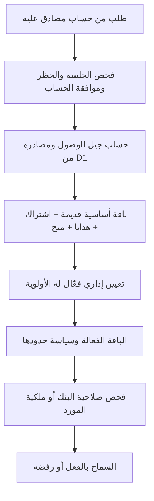

# مراجعة الاشتراكات والتجربة والوصول

المراجعة: 5 أكتوبر 2026. المصدر: `app`، فرع `main`، الالتزام `b7d08eea8ed9cc1a09d2cba4a1c0e117021842d5`. هذه مراجعة وتحقيق محلي استعدادًا للتعديل؛ لم يتغير منطق التطبيق ولم يحدث نشر أو تعديل لبيانات الإنتاج.

## النتيجة الأساسية

الخادم يحسب الوصول من مصادر متعددة مع كل طلب مصادق عليه. انتهاء اشتراك محدد المدة يمنع الاستفادة من ذلك المصدر عند بلوغ تاريخ النهاية، حتى قبل تشغيل المهمة اليومية. لكن انتهاء سجل الدفع لا يعني بالضرورة انتهاء Full Access: قد يبقى اشتراك أساسي قديم أو هدية أو منحة أو تعيين إداري بلا نهاية.

حدود التجربة الافتراضية صحيحة في المسار المعتاد لإنشاء الاختبار، لكن واجهة الدراسة ليست متسقة معها. أدوات السؤال تسمح بكتابة ملاحظات وإنشاء بطاقات ممنوعة على Free، ومسار المفضلة يبدأ دراسة دون التسجيل المسبق. نتيجة ذلك ليست مجرد ظهور أزرار غير مناسبة؛ قد يرفض الخادم حفظ حالة الدراسة الجديدة. هذه أعلى أولوية قبل تعديل الاشتراكات.

توجد كذلك عيوب في احترام تعطيل Flashcards من سياسة الباقة، وعرض انتهاء الهدايا، وتحديث حقول سجل الدفع عند الإلغاء. أما الاحتفاظ بالبيانات القديمة أو استمرار عضوية بنك خاص بعد انتهاء Full فهما سلوك مستقل عن اشتراك الدفع، ويجب تحديد السياسة المطلوبة قبل تغييره.

## 1. خريطة القرار ومصادر الوصول

المراجع الرئيسية:

| العنصر | المرجع | المنطق |
| --- | --- | --- |
| الحساب والجلسة | `lib/cloudflare-server.ts:310` | الجلسة صالحة وغير محظورة؛ المسارات المحمية تتطلب التحقق؛ معظم وظائف الدراسة تتطلب approved |
| الحساب الفعلي للوصول | `lib/entitlement-server.ts:22` | قراءة SQL جديدة لمصادر الوصول؛ ليست ثقة في tier القادم من المتصفح |
| تجميع المصادر | `features/subscriptions/server/access-sources.ts:6` | شرط الصلاحية والجيل الحالي لكل مصدر؛ نفس الحساب لقائمة المشتركين والجلسة |
| سياسة الباقة | `features/subscriptions/server/plan-policy.ts:7` | القيم الافتراضية مضافًا إليها `plan_prices.policy_json` |
| صلاحيات البنك | `features/access/domain/access-policy.ts:88` | بنك عام أو عضوية/ملكية أو Superadmin؛ Full لا يعطي وصولًا تلقائيًا لكل بنك خاص |
| سحب الوصول | `features/subscriptions/server/access-grants.ts:8` | زيادة generation وإبطال جميع المصادر القديمة منطقيًا مع حفظ السجلات |

ترتيب المصادر:

1. قبل أي سحب وصول، يؤخذ `profiles.profile_json.tier` أساسًا. إذا كان Full قديمًا فهو مصدر بلا نهاية.
2. يؤخذ الاشتراك active أو manually_activated إذا لم تنته مدته وكانت `access_generation` مساوية لجيل الحساب.
3. تؤخذ الهدايا active التي لم تنته والمنح الإدارية active في الجيل الحالي.
4. يختار النظام أعلى باقة من هذه المصادر؛ Full quarterly أعلى من monthly، وهما متطابقان في الميزات الافتراضية.
5. التعيين الإداري Full override الفعّال يفوز على الاختيار السابق. اختيار Free من لوحة الإدارة ينفذ **سحبًا دائمًا للمصادر الحالية** عبر الجيل، لا مجرد تغطيتها مؤقتًا بـFree.
6. النهاية المعادة للواجهة هي أطول نهاية بين المصادر الفعّالة، أو null إذا وجد مصدر بلا نهاية. هذه نهاية استمرار الوصول المجمّع؛ قد لا تمثل موعد انتهاء كل مصدر أو موعد تغير الباقة عند اختلاف السياسات المخصصة.

## 2. الباقات والتجربة المجانية الحالية

هذه قيم المصدر والترحيلات المحلية. يمكن للإدارة تعديل الأسعار والحدود والميزات من `policy_json`؛ لم تُقرأ إعدادات الإنتاج الفعلية.

| الميزة | Free trial | Full شهر / Full ثلاثة أشهر |
| --- | --- | --- |
| السعر الافتراضي | 0 | 100 / 230 ريالًا |
| مدة الوصول | لا توجد مدة زمنية للتجربة؛ حد استخدام | شهر / ثلاثة أشهر تقويمية للاشتراك المفعّل بهذا المسار |
| إنشاء الاختبارات العادية | اختباران طوال عمر الحساب | بلا حد شهري أو حد طوال العمر |
| الأسئلة في الاختبار الجديد | 15 | 500 |
| إنشاء بنك أو بنك خاص | ممنوع | مسموح |
| قراءة البنوك | وفق صلاحيات البنك | وفق صلاحيات البنك أيضًا |
| إضافة سؤال / اقتراح تصحيح | مسموح | مسموح |
| استيراد JSON | ممنوع | افتراضيًا 5 عمليات/يوم، 150 سؤالًا/عملية، 1000 قيد المراجعة؛ توجد ضوابط استيراد إضافية |
| الملاحظات الخاصة | ممنوعة من الحفظ الجديد/التعديل في الخادم | مسموحة |
| Flashcards | ممنوعة افتراضيًا؛ التفاصيل أدناه تكشف عدم الاتساق | مسموحة، بلا حصة تجارية افتراضية للبطاقات/المجموعات |
| إنشاء Ready Test جديد | ممنوع | مسموح |
| المشاركة في Ready Test منشور | وفق النشر وكود الدخول وسياسة المحاولات، وتوجد مشاركة ضيوف | نفس قواعد المشاركة |

`test_registry` هو العداد الدائم، وليس عدد عناصر History الظاهرة. حذف History لا يعيد الاختبارين. الاختبارات المسجلة أثناء الاشتراك المدفوع تُحسب أيضًا في lifetimeStartedExams؛ الرجوع إلى Free لا يمنح اختبارين جديدين. إعادة طلب تسجيل نفس testId ونفس عدد الأسئلة لا تستهلك مرة أخرى. المسار المعتاد يمنع إنشاء اختبار جديد بدون اتصال لتسجيله على الخادم.

## 3. مسارات التفعيل والتجديد

| المسار | نتيجة التنفيذ |
| --- | --- |
| checkout بمبلغ موجب | يتطلب قبول الشروط ويعيد رابط WhatsApp للتنسيق. لا يسجل دفعًا ناجحًا ولا يفعّل الاشتراك تلقائيًا |
| checkout بكوبون يجعل المبلغ صفرًا | يكتب حدث نجاح؛ trigger يستهلك استخدام الكود ويكتب الاشتراك ذريًا مع الجيل الحالي |
| تفعيل إداري لسجل الاشتراك | Superadmin متحقق بـMFA، باقة مدفوعة، نهاية مستقبلية يحددها المسؤول ومبلغ صحيح بالهللات |
| تعيين Full من جدول المشتركين | override فوري بلا نهاية؛ `expires_at:null` حتى لو كانت تسمية الاختيار «شهر» أو «ثلاثة أشهر» |
| تعيين من نافذة الإدارة | يمكن اختيار نهاية مستقبلية أو عدم وجود نهاية؛ مستقل عن سجل الدفع |
| شراء/منح هدية | ينشئ pass available؛ لا يبدأ الوصول قبل activate |
| تفعيل هدية | يبدأ العداد من لحظة التفعيل ويثبت الجيل الحالي. الأيام مدة ثابتة؛ الشهر/السنة تقويميان |

`calendar-duration.ts` يضبط الأيام عند اختلاف طول الشهر، بدل استخدام 30 يومًا لكل شهر. تفعيل كوبون صفر المبلغ يحسب نهاية التجديد من أطول نهاية وصول مستقبلية حالية إن وجدت، ثم يضيف مدة الباقة. `starts_at` المسجل هو وقت التفعيل؛ ليس موعد الانتظار حتى نهاية المصدر السابق.

حدود الكوبون لا تُفحص في الواجهة فقط. SQL trigger يتحقق من تشغيل الكود، نافذته الزمنية، الباقة المسموحة، الحد العالمي، حد المستخدم، والسعر والمبلغ النهائي الحاليين. requestId يحمي إعادة نفس عملية التفعيل؛ وبعد سحب الوصول لا تعيد إعادة الطلب القديم منح الوصول. التفعيل اليدوي والهدايا يثبتان generation الحالي أيضًا.

الهدايا **تتداخل زمنيًا** مع الاشتراك ومع هدية أخرى؛ لا تضيف مدتها تلقائيًا إلى آخر نهاية وصول. أثبت الفحص أن تفعيل هدية 9 أيام أثناء وجود اشتراك ينتهي بعد 90 يومًا لا يزيد نهاية وصول الحساب. لا أعتبر هذا خطأ حسابيًا بلا قرار منتج، لكن عرضه للمستخدم مهم حتى لا يستهلك هدية بلا فائدة إضافية. التفعيل المعاد لهدية مفعّلة يرجع 409؛ لا يفعّلها مرتين.

## 4. الانتهاء والإلغاء وسحب الوصول

| الحالة | النتيجة الفعلية |
| --- | --- |
| انتهاء اشتراك محدد المدة والحساب Free أساسًا ولا مصدر آخر | يعود الوصول إلى Free في أول طلب بعد النهاية، حتى لو بقيت حالة صف الاشتراك active |
| المهمة اليومية | تغيّر active/manually_activated المنتهية إلى expired، تضيف audit، وترسل تحديث الحساب للمستخدمين المتأثرين |
| وقت المهمة المعرّف | 01:30 UTC يوميًا، أي 04:30 بتوقيت الرياض؛ ليس مؤقتًا لكل مشترك |
| انتهاء اشتراك مع هدية/منحة/override صالح | يستمر Full من المصدر المتبقي |
| انتهاء اشتراك مع base tier قديم Full | يستمر Full بلا نهاية إلى أن يعالج هذا المصدر أو يُسحب الوصول |
| إلغاء سجل الدفع `operation:cancel` | يحول الاشتراك إلى cancelled وينهيه الآن؛ لا يلغي الهدايا والمنح والتعيينات الأخرى |
| اختيار Free في الإدارة | يسحب مصادر الوصول الحالية عبر زيادة generation؛ لا يمحو سجل الدفع أو الهدية؛ available يمكن تفعيلها لاحقًا في الجيل الجديد |
| تعليق الحساب | يمنع الجلسة المحمية بحسب suspended/suspendedUntil؛ آلية مختلفة عن الرجوع إلى Free |

لا يوجد في مسار checkout الحالي معالج دفع دوري يخصم تلقائيًا أو تجديد مالي تلقائي. الإجراء الآلي عند النهاية هو سقوط صلاحية المصدر وتحديث السجل، لا إلغاء تفويض دفع في خدمة خارجية. زر cancel الموجود في هذا المسار إداري ويتطلب Superadmin MFA.

ترحيل `0028_full_access_plans.sql` يحافظ صراحة على وصول المستخدمين القدامى ويحوّل Lite/Pro/Unlimited إلى Full في ملف الحساب. لذلك استمرار base Full ليس مجرد احتمال نظري في resolver، لكنه لا يثبت وجود هؤلاء المستخدمين حاليًا في الإنتاج. يلزم جرد المصادر الفعلية عند تنفيذ تغيير يمنع جميع الاشتراكات المحددة من الاستمرار.

تواريخ الأيام التي تختارها واجهة الإدارة تُرسل كـ`T23:59:59.999Z`. هذا يعني 02:59:59.999 من اليوم التالي بالرياض، وليس نهاية اليوم حسب توقيت الرياض. هذه نقطة تحديد سياسة زمنية قبل تغيير السلوك.

## 5. النتائج القابلة للإصلاح

### P1 — أدوات ممنوعة على Free تلوث الحالة وتمنع حفظ الإجابات

المراجع: `components/medguard-app.tsx:2799`، `:3143`، `:3397`، `:3079`، `components/flashcards-workspace.tsx:488`، `lib/cloudflare-server.ts:1037` و`:1054`.

أزرار الملاحظة الخاصة والبطاقة داخل الاختبار لا تفحص سياسة الباقة. `updatePrivateNote` يكتب النص في الحالة مباشرة، والنافذة تعرض «Saved automatically to your account». إنشاء بطاقة من السؤال يدخل البطاقات/المجموعات في الحالة دون فحص أيضًا. الخادم يرفض الملاحظة الجديدة على Free ويرفض أول مجموعة/بطاقة بسبب حدود الصفر.

أُنفذت دالة الملاحظة الفعلية المستخرجة بـTypeScript AST؛ أضافت النص دون أي شرط باقة. في API: حفظ اختبار Free أولًا نجح 200، ثم حفظ الملاحظة مع الإجابة الجديدة رجع 403، وظلت الإجابات المحفوظة في الخادم صفرًا. `saveStatePatch('exam')` يمر عبر نفس فحص الحالة؛ المشكلة يمكن أن تصل إلى checkpoints وليست محصورة بالمزامنة الكاملة.

الأثر: الملاحظات/البطاقات تظل محلية، وقد تمنع انتقال بقية حالة الاختبار للسحابة. لا أزعم فقدانًا حتميًا على الجهاز؛ تطبيق local-first يحتفظ بمحاولات الحفظ، لكن رفض الصلاحية يمنع تأكيد الحفظ السحابي حتى معالجة العنصر الممنوع.

الإصلاح المقترح: منع الفعل قبل تغيير الحالة، مع إظهار الترقية والمحافظة على مسودة المستخدم. مسار استعادة من الحالة المحلية المرفوضة يجب أن يحفظ إجابات الدراسة بدون تسريب بيانات أو حذف مسودات بصمت. يجب كذلك حماية الدخول المباشر لصفحة Flashcards وإعادة التحقق عند تغير الباقة؛ قفل زر القائمة وحده لا يكفي.

### P1 — دراسة المفضلة تبدأ قبل فحص العدد والحصة والتسجيل

المراجع: `components/medguard-app.tsx:7581`، `features/qbanks/domain/bookmarks.ts:33`، `lib/platform-server.ts:1307`، `lib/cloudflare-server.ts:1101`.

onStartBookmarks يفحص الوصول إلى البنك ثم ينشئ TestSession ويضيفه إلى الحالة وينتقل إلى الاختبار مباشرة؛ لا يستدعي exam-start ولا يفحص maxQuestionsPerExam أو lifetime allowance أو الاتصال. دالة الإنشاء ترشح العضوية في المفضلة والبنك وتزيل التكرار، لكنها لا تفحص الباقة.

أُنفذ handler الفعلي بـAST على 16 سؤالًا؛ بدأ شاشة الاختبار. طلب حفظ origin=bookmarks من حساب استنفد اختبارين رجع 403 EXAM_LIMIT_REACHED، وكذلك حفظ 16 سؤالًا من حساب Free جديد رجع 403. الخادم لا يعفي origin=bookmarks من حدود الاختبارات.

الأثر: تجاوز محلي لتوقعات التجربة وبدء جلسة قد لا تقبل المزامنة. يلزم اختيار سياسة واضحة: إن كانت دراسة المفضلة اختبارًا فتستخدم مسار التسجيل والحدود قبل البدء؛ وإن كانت أداة مجانية مستقلة فتُمثل وتُحفظ بهذه السياسة في الخادم أيضًا.

### P2 — تعطيل Flashcards في سياسة الباقة لا يمنع إنشاءها في الخادم

المرجع: `lib/cloudflare-server.ts:1037`، `features/administration/domain/plan-policy.ts:26`.

التحقق يعتمد على عدد البطاقات والمجموعات، ويستخدم canUseFlashcards في رسالة الخطأ فقط. تعطيل canUseFlashcards على Full مع إبقاء الحدود null لا يغيّر الحد العددي Infinity. في الفحص: الجلسة أعادت canUseFlashcards=false، لكن أول حفظ لمجموعة وبطاقة جديدتين نجح 200.

حتى مع حدود Free الصفرية، استخدام max(oldCount, configuredLimit) يسمح باستبدال محتوى وهويات بطاقات قديمة بنفس العدد بعد الانتهاء؛ اختُبر ذلك ونجح 200. حفظ البيانات القديمة سلوك مفهوم، لكن احتفاظها لا ينبغي أن يصبح تلقائيًا تصريحًا بإنشاء محتوى بديل إذا كانت السياسة تحظر الاستخدام.

الإصلاح المقترح: تطبيق boolean permission صراحة، مع فصل الاحتفاظ ببيانات سابقة عن الإنشاء/التعديل/المراجعة. يجب تحديد ما يبقى متاحًا بعد الانتهاء قبل تشديد هذه الأفعال.

### P2 — إلغاء الاشتراك يغيّر مبلغ الدفع والباقة في سجل الاشتراك

المراجع: `components/subscription-workspace.tsx:865`، `lib/platform-server.ts:2468`، `:2480`، `:2533`.

واجهة الإلغاء ترسل userId وoperation فقط. الخادم يملأ paid=0 ويختار full_monthly افتراضيًا، ثم يكتبها في UPSERT بدل الحفاظ على قيم السجل الموجود. في الفحص: سجل quarterly بمبلغ 23000 هللة صار cancelled / monthly / paid=0.

تظل أحداث الدفع السابقة وسياق previous في التدقيق؛ لم يثبت محو التاريخ المالي كله. المشكلة أن عرض Payment record المعتمد على صف subscriptions يصبح مضللًا، وقد يُضلل أي تقرير يعتمد على حقوله. الإصلاح المقترح: الإلغاء يغيّر الحالة والنهاية فقط ويحافظ على بيانات العملية المالية الأصلية، ويسجل حدث الإلغاء منفصلًا.

### P2 — هدية منتهية تبقى في المحفظة بحالة active

المراجع: `features/subscriptions/server/access-sources.ts:46`، `features/subscriptions/server/access-grants.ts:47`، `lib/platform-server.ts:202`، `components/contribution-center.tsx:312`.

الوصول الفعلي يستبعد الهدية عند expires_at<=now. لكن rewardStatusSql يعالج اختلاف generation فقط، والمهمة اليومية تحدّث subscriptions فقط. تحويل هدية إلى expired يحدث عرضًا عند تفعيل هدية أخرى لنفس المستخدم.

الفحص: فُعّلت هدية ثم جعلت نهايتها في الماضي وشُغلت المهمة اليومية؛ الجلسة رجعت Free والمحفظة أعادت active. هذا خطأ في الحالة المعروضة، وليس تمديد صلاحية فعليًا. الإصلاح المقترح: اشتقاق expired زمنيًا في قراءة المحفظة وتوحيد تنظيف/تدقيق الانتهاء دون الاعتماد على تفعيل آخر.

### P2 — الواجهة لا تضمن تغيير الباقة عند لحظة النهاية

المراجع: `components/medguard-app.tsx:1081`، `:6773`، `:6828`، `lib/realtime-client.ts:117`، `worker.ts:62`.

تحديث الحساب يعتمد على التفعيل/الإلغاء وأحداث Realtime والاتصال. يوجد عداد يومي لتحديث عرض الأيام، لكنه لا يعيد حساب الباقة عند نهاية الوصول. المهمة اليومية ترسل أحداث الانتهاء لسجلات subscriptions فقط؛ لا يوجد حدث مماثل لمجرد بلوغ نهاية هدية أو override.

في صفحة باقية مفتوحة مع اتصال مستقر، قد تظل صلاحيات user.planLimits القديمة ظاهرة حتى حدث أو إعادة قراءة للحساب، بينما الطلب المحمي في الخادم قد صار Free. لم أختبر هذا بصريًا في متصفح أو PWA؛ النتيجة تحليل لمسار التحديث، ولا تثبت استمرار صلاحية الخادم. العودة من تبويب مخفي تعالج الأحداث التي استقبلت أثناء إخفائه بواسطة hiddenTopics؛ لذلك لا يصح تعميم أن الرجوع للواجهة يفقد جميع تحديثات الحساب.

الإصلاح المقترح: إعادة تحقق واحدة عند أقرب موعد تغير لأي مصدر، مع إعادة التحقق عند الاستئناف. effectivePlanExpiresAt هو أطول نهاية وصول؛ قد يلزم nextEntitlementChangeAt مستقل لتغير مصادر/سياسات قبل أطول نهاية. تحديث سياسة الأسعار ينبغي أيضًا أن يحدث حدود الحساب، لا كتالوج السعر وحده.

## 6. نقاط تحتاج قرار سياسة، لا إصلاحًا عشوائيًا

| السلوك المثبت | القرار المطلوب |
| --- | --- |
| تعيين باقة من جدول الإدارة يمنحها بلا نهاية | هل التعيين منحة مفتوحة أم اشتراك بمدة اختيار الباقة؟ الواجهة تشير حاليًا إلى no expiration |
| الهدايا تبدأ الآن وتتداخل مع الوصول الموجود | إبقاؤها مستقلة أم جعلها امتدادًا/طابورًا، مع شرح أثر التفعيل للمستخدم |
| base Full القديم مصدر دائم | الحفاظ على المنح القديمة أم نقلها إلى سجل منحة صريح يمكن تدقيقه وانتهاؤه |
| اختبار سابق كبير يمكن استكماله بعد الانتهاء | الحفاظ على إجابات المستخدم واستكمال ما بدأه أم منع الدراسة الجديدة عليه؛ الفحص أثبت قبول حفظ 30 سؤالًا قديمًا ورفض إنشاء 30 جديدًا |
| Ready Test موجود يمكن تغيير محتواه ونشره بعد الانتهاء | canCreateReadyTests يقيّد create فقط؛ save يتحقق من الملكية والموافقة. قد يكون استمرار إدارة ما أنشأه المستخدم مقصودًا |
| عضوية/ملكية بنك خاص تبقى بعد انتهاء Full | صلاحية البنك منفصلة عن إنشاء بنك جديد؛ Full المنتهي لا يزيل العضويات تلقائيًا |
| تغيير questionIds داخل testId مسجل لا يستهلك اختبارًا جديدًا | الفحص قبل استبدال كل الـ15 سؤالًا في نفس testId وأبقى lifetime=1. إذا كانت التجربة تعني مجموعتي أسئلة ثابتتين، يلزم تثبيت عضوية الاختبار من الخادم؛ لا توجد واجهة إعادة بناء عادية مثبتة لهذه الحالة |
| إلغاء سجل الاشتراك يترك مصادر أخرى صالحة | واجهة الإدارة تميز بالفعل Payment & renewal records عن access؛ يلزم الحفاظ على هذا الفرق وتسميته بوضوح |

لا تُعد مشاركة Ready Tests المنشورة مجانيةً تجاوزًا تلقائيًا للتجربة؛ المشاركة والضيوف مسار مستقل، وتخضع لسياسة كل اختبار. كذلك الرجوع إلى Free ليس تعليقًا للحساب ولا حذفًا للبيانات.

## 7. التحقق المنفذ وحدوده

نُفذت الترحيلات 0000–0034 في D1 مؤقتة بـMiniflare مع ملفات ومستخدمين اصطناعيين. لم يُستخدم دفع أو WhatsApp أو قاعدة إنتاج. الأدلة المحلية في `.ui-review/` ملفات مهملة من Git:

| الدليل | النتيجة |
| --- | --- |
| 8 حالات `access-revocation-api.mjs` الحالية | نجاح؛ تشمل حفظ التاريخ، جيل المنح الجديدة، إعادة السحب، سباق التفعيل/السحب، rollback عند فشل audit، كوبون جديد، إعادة checkout قديم، واتساق قائمة المشتركين والصلاحيات |
| 16 حالة تحقيق إضافية متميزة في `subscriptions-access-probe.mjs` | نجاح توقعات التحقيق؛ منها إثبات العيوب المذكورة، انتهاء قبل cron، checkout موجب، كوبون صفر وإعادته، واستكمال اختبار قديم |
| 5 بدايات اختبار متوازية لحساب Free جديد | بالضبط 2×201 و3×403؛ حذف History لم يُعد الرصيد |
| 6 محاولات تزامن حفظ حالة مع بداية اختبار عند آخر حصة | كل محاولة انتهت بعداد 2؛ لم يُثبت تجاوز الحصة في هذا الجدول الزمني. لا أعد هذا برهانًا عامًا لكل التزامنات |
| handlers فعلية مستخرجة بـTypeScript AST | المفضلة بدأت 16 سؤالًا دون تسجيل، والملاحظة أُضيفت دون فحص باقة؛ ليست اختبارات عرض متصفح |
| خط الأساس السابق على نفس المصدر | 53 ملف دخول لاختبارات Node، TypeScript، oxlint، schema check، وbuild نجحت قبل هذه المراجعة؛ لم يتغير المصدر بعدها |

النتائج: `.ui-review/subscriptions-access-probe-results.json` يحفظ الجولة التي تتضمن حالات سحب الوصول الثماني؛ `.ui-review/subscriptions-access-extra-results.json` يحفظ الجولة الموسعة ذات 16 حالة؛ `.ui-review/subscriptions-client-probe-results.json` يحفظ تحقق الدوال. توجد حالات مشتركة بين الجولتين؛ العدد 24 حالة API متميزة، وليس مجموع عدد الأسطر في الملفين.

لم تُختبر تجربة بصرية فعلية لحساب حقيقي، أو دقة توقيت Cloudflare cron وتشغيله في الإنتاج، أو توزيع legacy tiers والمنح غير المنتهية في قاعدة الإنتاج. لم تُفحص خدمة دفع خارجية لأن مسار الدفع الحالي لا يستدعي واحدة.

## 8. ترتيب التعديل المقترح

1. توحيد بوابات أدوات الدراسة والمفضلة مع الخادم، ومعالجة الحالة المحلية المرفوضة دون الإضرار بإجابات المستخدم.
2. فصل الاحتفاظ بالبيانات عن استخدام ميزات Full بعد الانتهاء وتطبيق سياسة Flashcards صراحة.
3. المحافظة على بيانات الدفع عند cancel وتوحيد الحالة المعروضة للهدايا المنتهية.
4. ضمان إعادة تحقق الواجهة عند تغير مصادر الوصول، بما فيها الهدايا والتعيينات المحددة.
5. حسم سياسات المنح المفتوحة، الهدايا المتداخلة، العضويات والاختبارات السابقة، ثم تنفيذ تغييرات المدة والترحيل إن كانت مطلوبة.

أي تعديل لاحق ينبغي أن يحافظ على generation وidempotency وذرية استهلاك الكوبونات، وأن يختبر حساب Free، اشتراك منتهٍ، مصادر متداخلة، سحب ثم هدية جديدة، والتزامن مع المزامنة. هذه الأجزاء اجتازت التحقيق الحالي ولا تحتاج استبدالًا شاملًا.
