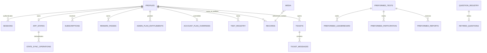

# Database and entity map

## Technology

- Cloudflare D1 / SQLite, schema defined with Drizzle ORM.
- Runtime access is predominantly raw prepared SQL through the Workers binding `env.DB`.
- Migrations `0000`–`0019` are the deployment history. `0004` contains the main platform expansion and seeded content.
- The audit did not apply a migration or write to the configured local/remote database.

## Entity relationship map

QBank, membership, invite, share-link, proposal, shared-question, shared-note, answer-statistic, taxonomy, role-application, announcement, security, legal-link, and audit entities are encoded as typed JSON rows in `records`; their logical relationships are not D1 foreign keys.

## Physical table inventory

| Group | Tables | Purpose / important constraints |
| --- | --- | --- |
| Identity | `profiles`, `sessions`, `university_claims` | unique email/claim; hashed session token; session expiry/verification |
| Personal state | `app_states`, `state_sync_operations` | one state per user; revision and idempotency operation log |
| Collaboration | `records` | `(type,id)` primary identity; indexed type/qbank/owner/email; JSON payload |
| Classification | `qbank_classification_revisions`, `classification_operations` | revisioned specialty/topic changes and operation dedupe |
| Question IDs | `question_ids`, `question_id_allocator`, `question_id_free_pool`, `question_registry`, `retired_questions`, `counters` | stable display IDs, allocation/reuse rules, retired identity protection |
| Media/storage | `media`, `r2_usage_periods` | storage key, owner/QBank/question metadata, hashes, usage counters |
| Plans/billing | `subscription_settings`, `plan_prices`, `discount_codes`, `account_plan_overrides`, `subscriptions`, `subscription_events` | pricing, redemption and effective entitlement inputs |
| Exams | `test_registry` | lifetime/monthly starts and question count |
| Preformed tests | `preformed_tests`, `preformed_leaderboard`, `preformed_question_stats`, `preformed_participation`, `preformed_attempt_tokens`, `preformed_submission_receipts`, `preformed_reports` | versioned tests, tokenized attempts, idempotent submissions, ranked results |
| Contact | `tickets`, `ticket_messages` | private support/report threads with question snapshot/reference |
| Imports | `import_batches`, `imported_files`, `json_import_suspensions`, `duplicate_attempts` | limits, dedupe, suspension and duplicate monitoring |
| Economy | `contribution_accounts`, `credit_transactions`, `reward_passes`, `contribution_reviews`, `review_completion_claims` | credit balance, ledger, reward access, review attribution |
| Administration | `admin_plan_entitlements`, `account_deletions` | manual grants and deletion audit/idempotency |

## Generic record types

Observed types include `qbanks`, `qbankFolders`, `qbankMemberships`, `qbankInvitations`, `qbankShareLinks`, `questionProposals`, `sharedQuestions`, `qbankSpecialties`, `qbankTopics`, `answerStats`, `sharedNotes`, `roleApplications`, `universityIds`, `adminInvites`, `system`, `announcement`, `legalLinks`, `auditLog`, and review-history preferences.

## Constraints and triggers

Verified migration triggers cover:

- university-claim validity and uniqueness;
- discount usage, per-user redemption, pricing, and subscription activation;
- question identity insert/update/delete and question-ID release;
- Lite/free exam limits and question counts;
- JSON import daily/file/pending limits;
- credit balance and application;
- reviewer completion claims;
- app-state and classification revisions;
- preformed-test attempt/submission limits.

## Deletion behavior

- Several dedicated tables have foreign keys, but cascade behavior is inconsistent by entity.
- The account-deletion service explicitly deletes private data, preserves/anonymizes shared/public history, and defensively handles legacy tables.
- `records.qbank_id` and `records.owner_id` are not foreign keys. Deleting a QBank relies on application-generated related record operations and media cleanup; a direct allowed bank-row deletion can leave logical orphans.
- Question hard deletion is coupled to registry/retirement logic and ID release rules and must not be replaced by an uncoordinated generic delete.

## Schema drift / legacy

Migration `0007_pilot_data_foundation.sql` introduced derived sync/stat tables. Migration `0016_remove_unused_derived_state.sql` removed them, and `db/schema.ts` no longer declares them. Cleanup code still checks `sqlite_master` so deletion can tolerate older installations. This is intentional compatibility code until all deployed databases are proven migrated.

