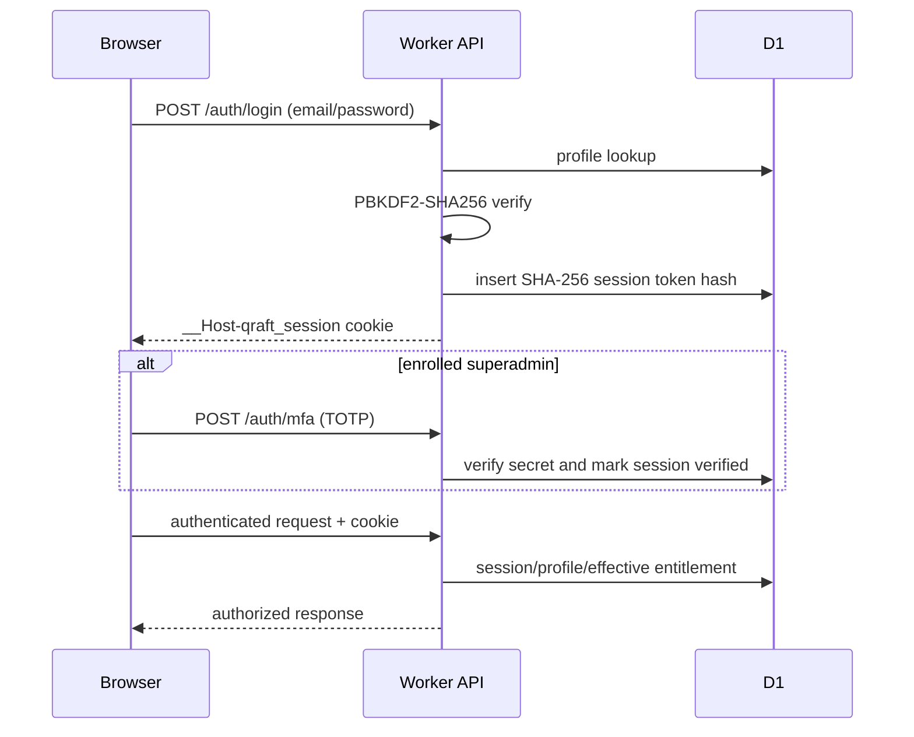

# Data-flow maps

## Authentication



Cookie: `__Host-qraft_session`, `Path=/`, `HttpOnly`, `Secure`, `SameSite=Lax`, seven-day maximum. Superadmin pre-MFA sessions are initially unverified and expire in five minutes. Logout deletes the current session.

## Question lifecycle

1. Contributor/editor obtains stable IDs through `/ids/reserve`.
2. A user contribution becomes a `questionProposal`; direct shared-question edits require appropriate bank authority/review rules.
3. Server validation checks fields, classification, source, version/history, plan/import limits, and bank access.
4. Reviewer queue reads scoped proposals. Approval/rejection updates proposal history; high-risk corrections require independent review according to tests.
5. Approval writes `sharedQuestions`, identity/attribution and review completion data, then publishes bank/catalog invalidations.
6. Reports use contact tickets or preformed reports depending on context.
7. Hard delete is restricted to an editor/manager path, removes/reconciles related data and media, and applies ID registry/retirement behavior.

**Risk points:** generic records lack FKs; deletion correctness depends on coordinated operations. Audit-log record contents are client-influenceable.

## QBank lifecycle

```text
Create (Pro+, server policy)
→ configure visibility/taxonomy
→ owner issues invite/share link
→ user previews and explicitly accepts/declines
→ membership grants viewer/editor/reviewer scope
→ owner manages roles/content/share
→ delete triggers record/media cleanup
```

Essential/SMLE banks are superadmin-managed; ordinary users submit proposals. QBank owner is authoritative on the bank record; membership role is a separate record. Client also carries reviewer/viewer ID arrays, creating synchronization requirements.

## Exam lifecycle

1. UI builds filters/mode/count from the active bank.
2. `/platform/test-pool` returns an authorized filtered pool.
3. `/platform/exam-start` and/or state save registers usage; server and triggers enforce plan limits.
4. A `TestSession` is saved immediately to IndexedDB; active exam checkpoints use `/state/exam`.
5. Answers, navigation, marks, notes and timing update the local snapshot. Page hide/visibility hide attempts a keepalive save.
6. Finish writes results/history/progress; tutor mode exposes explanation during the session.
7. History/review renders from synchronized personal state, while shared answer distributions come from collaboration records.

Error/retry: operation IDs and revisions make server retries idempotent and reject stale revisions. Offline creation of a new exam is intentionally blocked because start usage must be registered.

## Flashcard lifecycle

Create from question/manual/import → store deck/card/schedule in personal state → immediate IndexedDB save → Pro/Unlimited server count enforcement on sync → FSRS study rating updates schedule/log → checkpoint/full sync → merge across devices.

Whole collections use timestamp-based snapshot selection during merge; independent same-account edits on two devices can lose the older snapshot.

## Review lifecycle

Suggestion/proposal → classified/source-validated pending record → reviewer/bank reviewer scoped queue → decision/history version update → approved question or rejection → review completion claim/credits → realtime invalidation → client refetch/merge.

Bulk review is capped at 200 and tested atomically. Reviewer-history clearing is a per-account preference, not deletion of shared review attribution.

## Subscription lifecycle

Plan status reads all entitlement sources → quote calculates configured/default price and discount → 100%-discount checkout atomically creates a one-year subscription, otherwise returns WhatsApp coordination URL → admin/payment coordination activates manually → user invalidation/refetch → daily cron expires due subscriptions → fallback entitlement becomes effective.

## Common stale/duplicate-write controls

- Personal state: revision + operation ID + tab lock + BroadcastChannel + outbox.
- Resource reads: single-flight Map cache and invalidation tags.
- Preformed submissions: submission receipt and attempt token.
- Imports: batch/file identities and duplicate-attempt records.
- Collaboration: diff operations and current-record validation, but no offline operation outbox.

