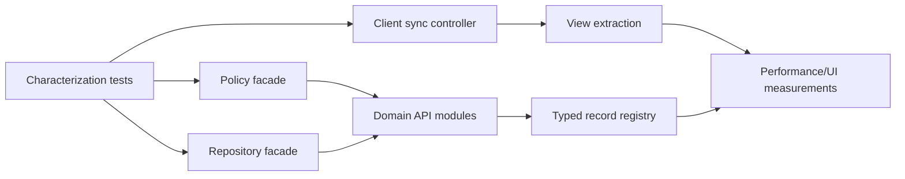

# Recommended input for Phase 1 — codebase refactor

## Refactor objective

Reduce change radius and make policy/data-flow boundaries testable while preserving every invariant in `14-system-invariants.md`. Phase 1 should not redesign authorization, entitlement semantics, schema, PWA UI or product behavior.

## Recommended sequence

1. **Lock the baseline.** Keep the 80 existing tests green; add characterization tests for audit-record input, first-state note validation, preformed leaderboard scope, offline collaboration reconnect, and hidden-tab invalidation. Tests should capture current behavior even where Phase 3 will later change it.
2. **Fix tooling reproducibility as an isolated decision.** Align local Cloudflare runtime/config only after choosing whether config date or package version is authoritative. Do not combine with application extraction.
3. **Extract pure policy facades without changing decisions.** Create stable interfaces for account capabilities, QBank capabilities and plan capabilities, delegating to current helpers.
4. **Split API dispatch by domain.** Move auth/state, collaboration/QBank/media, subscription/economy, review/import, and preformed handlers behind the same catch-all contract and response format.
5. **Extract persistence repositories.** Encapsulate D1 statements for profiles/sessions, personal state, generic records, question identity, entitlement and preformed tests. Preserve raw SQL and transaction ordering initially.
6. **Extract client sync controller.** Separate IndexedDB persistence, personal cloud sync, collaboration sync, realtime invalidation and lifecycle/page-hide behavior from `medguard-app.tsx`.
7. **Split view components.** Move dashboard, builder, exam session/results/history/progress/settings shells into modules while keeping the existing `View` state and public UI behavior.
8. **Create typed record registry.** Centralize generic record type ↔ serializer ↔ authorization ↔ audit ↔ invalidation metadata without migrating data.
9. **Measure and compare.** Re-run tests, lint, bundle size and viewport matrix after every boundary extraction.

## Dependency graph



## Areas to leave untouched initially

- Migration files, table/field names, question registry and seeded identities.
- Effective-entitlement precedence and explicit override semantics.
- Account deletion transaction order and legacy-table checks.
- Session cookie/TOTP/password parameters.
- QBank ownership and essential-bank policy.
- Exam registry limits and D1 triggers.
- R2 key format, media metadata and backup naming.
- Service worker/iOS zoom/safe-area behavior until Phase 4.
- Positive-price checkout business flow until product decision.

## High-risk modules

1. `lib/cloudflare-server.ts` — collaboration `recordAllowed`, state saves, authentication.
2. `lib/platform-server.ts` — subscription/economy atomicity, import/review operations.
3. `components/medguard-app.tsx` — hydration, dirty-state lifecycle, cross-device merge, exam checkpoints.
4. `db/schema.ts` + migrations — triggers encode business rules not obvious in TypeScript.
5. `lib/preformed-test-server.ts` — guest tokens, idempotency and ranking.
6. `lib/account-deletion-server.ts` — privacy/integrity transaction plus external cleanup.

## Suggested module boundaries

```text
server/auth        sessions, credentials, MFA, account lifecycle
server/state       personal state validation, checkpoints, revisions
server/qbank       access policy, record operations, questions, media
server/review      proposals, decisions, reviewer metrics
server/billing     plans, quote, subscription, discount, economy
server/preformed   owner/participant/moderation flows
server/repositories D1/R2 adapters only
client/sync        local DB, outbox, merge, realtime, lifecycle
client/views       dashboard, library, exam, flashcards, settings, admin
shared/policy      pure role/plan/QBank capability functions
```

## Exit criteria for Phase 1

- No API path/method/payload/status change unless separately approved.
- No schema or data migration.
- All baseline tests pass plus new characterization tests.
- Bundle/request/viewport baseline is not materially worse.
- Git diff contains only refactor/test/documentation changes with an explicit invariant checklist.
- Phase 3 findings remain documented, not silently “fixed” inside structural changes.
