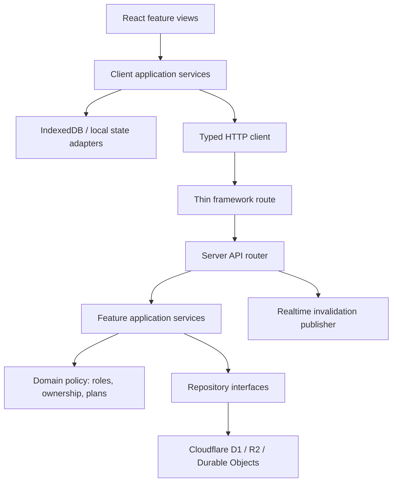

# Phase 1 Target Architecture

Status: **approved working target for Phase 1**  
Baseline commit: `b874cb60675b964a95e61868cfa07653ee6b49a8`  
Refactor branch: `refactor/phase-1-architecture`

## Design constraints

- Preserve all Phase 0 invariants, request/response contracts, persisted record shapes, IDs, permissions, entitlement outcomes, UI behavior, and PWA/local-first behavior.
- Keep framework routes thin. They adapt HTTP requests to application services and do not own business rules.
- Organize new boundaries by business capability rather than by technical file type.
- Keep server-only dependencies out of client modules and keep Cloudflare bindings behind infrastructure adapters.
- Make authorization and entitlement decisions explicit and discoverable at the application-service boundary.
- Introduce boundaries incrementally. Compatibility facades are allowed during migration and are removed only when every caller has moved.
- Avoid broad barrel exports. Each feature exposes a small deliberate public surface.

## Target layers



## Intended repository layout

```text
app/
  app/                         # Vinext route entry points only
  features/
    access/domain/             # roles and authorization policy
    subscriptions/domain/      # plan limits and entitlement policy
    auth/server/               # authentication application boundary
    state/                     # personal-state domain and server boundary
    collaboration/             # collaborative records and write policy
    qbanks/                    # QBank lifecycle application boundary
    media/                     # upload/serve/delete boundary
    exams/                     # exam domain and client views
    flashcards/                # flashcard domain and client views
    review/                    # review workflow
  server/
    api/                       # routing, rate limits, response orchestration
    http/                      # bounded parsing, origin checks, responses
    infrastructure/            # Cloudflare-specific adapters
  components/                  # shared presentation components only
  lib/                         # compatibility facades and truly shared utilities
  workers/                     # Worker and Durable Object entry points
```

The directory is introduced gradually. Existing feature modules remain in place until a controlled move has a clear owner and tests.

## Boundary rules

| From | May depend on | Must not depend on |
| --- | --- | --- |
| Framework routes | server API router | database statements, business policy |
| React views | feature client services, shared UI | Worker bindings, D1/R2 repositories |
| Client services | domain policy, HTTP/local adapters | route implementations |
| Server application services | domain policy, repository interfaces | React components, browser storage |
| Domain policy | domain types and pure helpers | network, database, framework APIs |
| Infrastructure adapters | Cloudflare bindings, repository contracts | UI state |

## Stable contracts

These contracts are frozen during Phase 1:

- `/api/cloudflare/*`, `/api/platform/*`, `/api/preformed-test/*`, realtime and media route semantics.
- D1 schemas, migrations, generic-record types, JSON payloads, object keys, and R2 paths.
- Cookie names, session behavior, MFA flow, origin validation, role/ownership checks, and plan limits.
- IndexedDB database names, stores, keys, sync queues, retry behavior, and cross-device merge behavior.
- User-visible routes, labels, workflows, styling, and responsive behavior.

## Migration waves

1. **Foundation:** document the target, extract pure access/plan policy, centralize HTTP primitives, and add boundary tests.
2. **Server API boundary:** replace the catch-all route implementation with a thin adapter and explicit method routers; keep responses unchanged.
3. **Feature service façades:** route auth, state, collaboration, QBank, and media calls through named feature entry points; retain the legacy implementation internally where a physical split is too risky.
4. **Client composition:** extract low-risk pure helpers and shared UI primitives from the root application component; preserve state ownership and sync timing.
5. **Consolidation:** remove proven duplicate helpers and dead compatibility surfaces only after import searches and tests establish zero use.
6. **Verification and handoff:** run the full regression matrix, compare performance, record deferred work, and produce Phase 2/3 inputs.

## Explicit non-goals

- No schema migration or data repair.
- No authorization, security-policy, or billing behavior changes.
- No UI redesign or navigation change.
- No service-worker caching redesign or cross-device sync redesign.
- No package upgrades merely to modernize the stack.
- No remediation of Phase 0 security findings; those remain `SECURITY — DEFERRED TO PHASE_3`.

