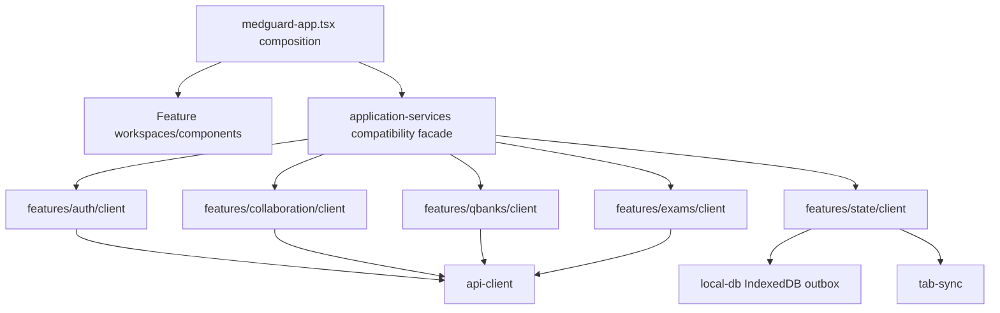

# Frontend Architecture

## Current composition

## State ownership

- React continues to own active view and transient interaction state.
- `local-db.ts` continues to own IndexedDB state, drafts, and queued sync operations.
- `features/state/client/state-sync-client.ts` owns remote revision tracking, conflict retry, outbox flushing, and cross-tab notices.
- `api-client.ts` continues to own session-scoped request caching and invalidation.
- `local-preferences.ts` continues to own per-account theme preference.
- No store names, keys, merge order, retry order, request paths, or persistence timing changed.

## Deliberate compatibility surfaces

`lib/application-services.ts` remains because the root component has many imports and changing every call site in the same wave would add risk without changing ownership. It contains re-exports only. `lib/cloudflare-client.ts` remains for external/internal compatibility and also contains re-exports only.

## Remaining frontend debt

- `components/medguard-app.tsx` is still 6,922 lines and coordinates many workflows.
- Several mature workspaces remain large, particularly preformed tests and flashcards.
- Dynamic loading and feature chunking are not changed in Phase 1.

These are `DEFERRED_TO_PHASE_2` because reducing bundle size or React orchestration further requires performance measurement and broader browser/device regression coverage. Visual redesign is `DEFERRED_TO_PHASE_4`.

