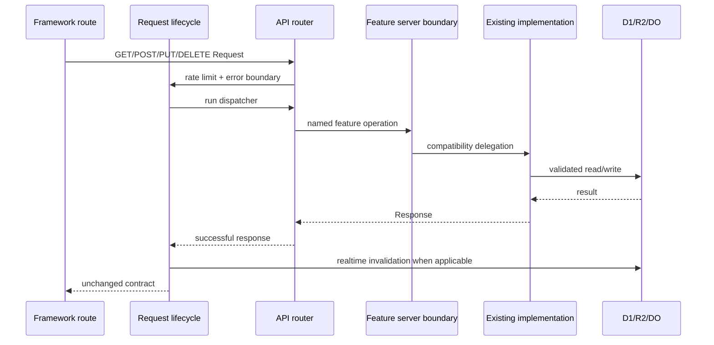

# Backend Architecture

## Request path

## Layer responsibilities

- `app/api/cloudflare/[...path]/route.ts`: framework export only.
- `server/api/cloudflare-router.ts`: method/path dispatch only.
- `server/api/request-lifecycle.ts`: IP rate limits, mutation/auth limits, error normalization, and successful-mutation notification.
- `server/http/*`: bounded request reading, JSON parsing, same-origin assertion, and no-store JSON response construction.
- `features/*/server/*`: named capability entry points.
- `lib/cloudflare-server.ts`, `lib/platform-server.ts`, `lib/preformed-test-server.ts`: current application-service implementation and transactions.
- Repository/storage modules: D1 statement ownership, question-ID allocation, R2 accounting, backups.

## Cloudflare conformance

- Worker and Durable Object classes use generated `Cloudflare.Env` types.
- Scheduled/background work remains attached with `ctx.waitUntil`.
- Durable Object WebSockets continue to use hibernation APIs.
- No mutable request-specific global state was introduced.
- Payload limits and streaming body reads were preserved.

## Transitional boundary

The feature server services currently delegate to `lib/cloudflare-server.ts`. This is intentional: the file has shared transaction and authorization context across authentication, personal state, collaboration, and media. The route and all external callers are now insulated, so later physical extraction can occur one feature at a time. Further extraction is `DEFERRED_TO_PHASE_2`, not treated as completed work.

