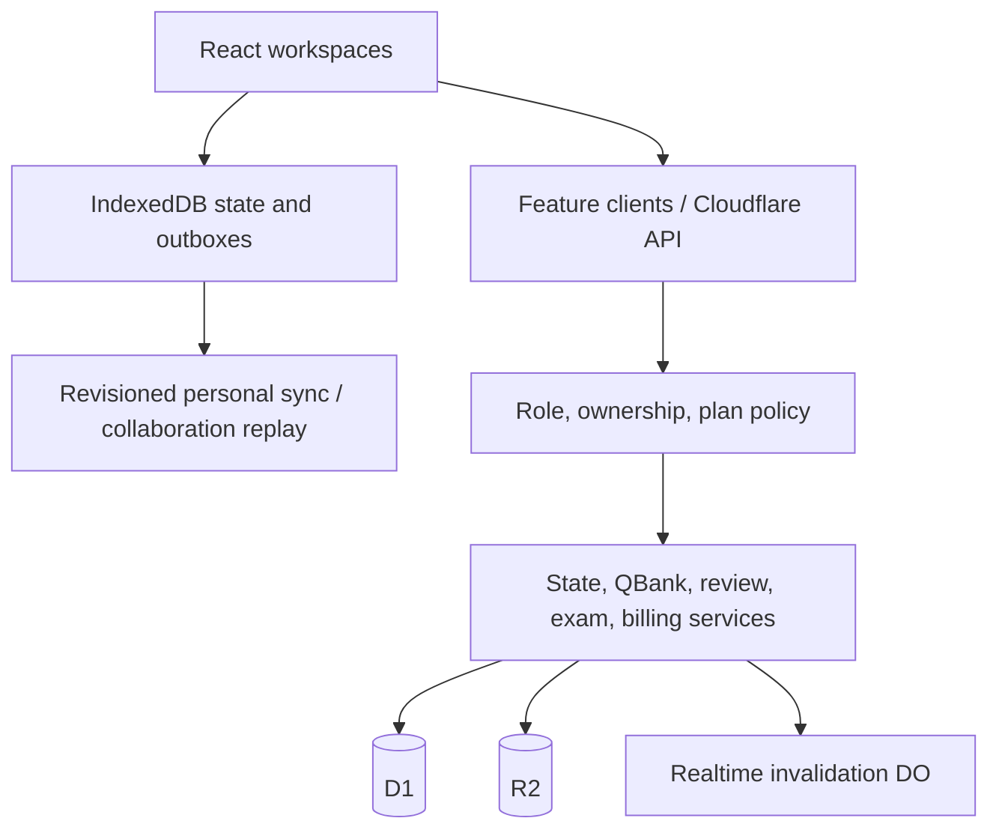

# Logic and Source-of-Truth Map

| Concept | Authoritative source | Derived/cache copies | Update and consistency rule |
| --- | --- | --- | --- |
| Identity/account state | D1 `profiles` + verified `sessions` | React account, API cache | Every protected request reloads the session/profile; account invalidation refetches |
| Roles | profile JSON (`role`, `platformRoles`) | `isAdmin`, visible navigation | Canonical access helpers derive capabilities; server decides |
| Effective plan | `getEffectiveEntitlement()` over base tier, subscription, reward, admin grant, override | session user, subscription workspace | Explicit override wins; expired sources are ignored |
| QBank ownership | `records:qbanks.ownerId` | React collaboration state | Owner/root-only mutations; D1 record is authoritative |
| Membership | `records:qbankMemberships` | QBank reviewer/viewer arrays | Membership record wins; Phase 2 prevents duplicate bank/user memberships |
| Question identity | `question_registry`, `question_ids`, `retired_questions` | question JSON `questionId` | triggers keep identity stable and retire deleted UUIDs |
| Question/review state | question/proposal records and completion claims | reviewer/UI cache | reviewed payload must match publication; decision writes are atomic |
| Personal study state | revisioned D1 `app_states` after sync | IndexedDB + React | operation ID + revision; local state leads while dirty/offline |
| Collaborative state | D1 `records` | IndexedDB + React | record operations; Phase 2 adds durable offline snapshot outbox |
| Exam usage | `test_registry` | state tests and plan UI | server/D1 limit enforcement |
| Coupon usage | successful `subscription_events` + `discount_codes.uses` | quote/admin UI | trigger-controlled atomic redemption |
| Subscription expiry | canonical UTC `subscriptions.expires_at` and other entitlement rows | session plan fields | request-time calculator plus scheduled status transition |
| Theme | localStorage | React/server theme placeholder | intentionally device-local; server state remains `system` |

## Major dependency flow

## Conflict rules

- Personal-state conflicts retry against the latest server revision.
- Collaborative live refresh uses a three-way base/local/remote merge; replay operations are still reauthorized by the server.
- Server deletion is authoritative in collaborative merges and does not resurrect deleted records.
- Some whole personal-state collections still use newest-snapshot selection; see unresolved issue P2-U01.
