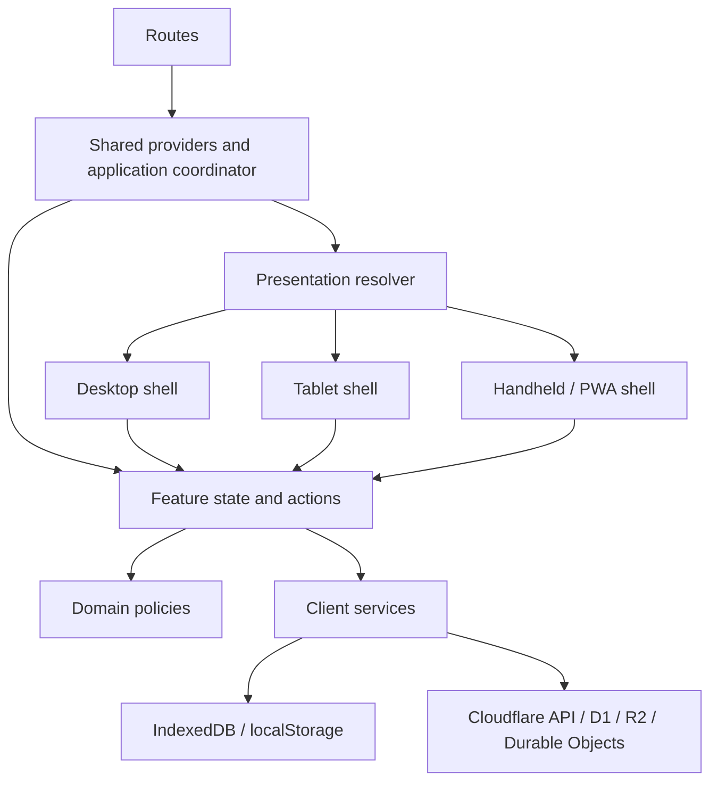

# Qraft Presentation Architecture

## Architectural decision

Qraft remains one product core. Authentication, entitlements, access policy, exam state, question state, collaboration, validation, persistence, synchronization and API access remain shared. Desktop, tablet and handheld/installed-PWA code may compose those capabilities differently but may not reimplement them.



## Shared-core boundary

Shared core owns:

- authenticated account, roles, plan and bank access;
- active QBank and all persistent study settings;
- exam creation, selection, progression, marking, grading, pausing and submission;
- highlights, notes, flashcards, progress and review decisions;
- API calls, error normalization, optimistic mutation and synchronization;
- local persistence, collaboration outbox and conflict handling.

Presentation must call shared actions. It must not reproduce plan limits, role checks, merge behavior or persistence timing.

## Presentation boundary

The resolver is the sole JavaScript authority for presentation mode. It uses media capabilities and viewport classes—not user-agent sniffing—and exposes:

- `desktop`: fine-pointer/hover or wide stable viewport;
- `tablet`: medium viewport, including touch-first portrait/landscape adaptation;
- `handheld`: narrow/coarse presentation intended for one-handed use;
- `standalone`: installed PWA state, independent of the size mode;
- visual-viewport dimensions and keyboard occlusion when available.

Low-level feature components do not call `matchMedia`, inspect `innerWidth`, or receive generic `isMobile` flags. A route/shell selects a presentation component. Small responsive differences remain CSS responsibilities.

## Shells

### Desktop shell

- persistent, compact navigation rail/sidebar;
- stable workspace header and high-information-density content canvas;
- keyboard-visible focus and pointer affordances;
- persistent or resizable panels where they improve study speed.

### Tablet shell

- adaptive navigation rail on landscape and compact rail/drawer on portrait;
- touch-sized controls while preserving multi-column content when useful;
- does not inherit the phone bottom navigation merely because width is below 1024px.

### Handheld / installed-PWA shell

- contextual safe-area-aware top bar;
- exactly one owned scroll surface;
- stable primary bottom navigation;
- contextual study actions separated from global navigation;
- sheets or full-screen flows for navigator, notes, Labs and complex forms.

## State ownership

| State | Owner |
| --- | --- |
| identity, roles, plan, QBank access | shared core/server session |
| selected answer, current question, exam status | shared feature state |
| notes, highlights, mark, daily goal, flashcard schedule | shared feature state/persistence |
| sidebar density, rail expansion, panel width | desktop presentation |
| active sheet, compact-toolbar expansion | handheld presentation |
| installed mode, visual viewport, keyboard occlusion | presentation environment |
| theme preference | shared local preference applied before paint |

The test for ownership is: if a layout change does not alter the meaning of the state, the state belongs outside the presentation.

## Routing

Semantic paths render the same application coordinator with an initial destination. Navigation updates the URL without creating separate mobile/desktop routes. Query-token invitation and ready-made-test entry remain compatible.

Implemented route families:

- `/` and `/study`
- `/qbanks` and `/qbanks/:id`
- `/exams/new`, `/exams/:id`, `/history`
- `/flashcards`, `/progress`, `/review`, `/settings`, `/account`, `/subscription`
- `/Admin` remains the privileged portal.

Direct entry must authenticate, hydrate shared state, validate the destination against role/plan/resource state, and then select the correct shell without showing another shell first.

## Safe-area ownership

- the root paints the complete viewport;
- shell top chrome owns `safe-area-inset-top`;
- primary bottom navigation or contextual action bar owns `safe-area-inset-bottom`, never both;
- sheets own all four insets inside their portal;
- feature content receives already-safe available space and must not add a second global inset.

## Future feature template

```text
feature/
  domain/          product rules and pure models
  client/          API, cache and persistence adapters
  state/           shared state/actions/hooks
  presentation/
    shared/        semantic feature primitives
    desktop/       desktop composition
    handheld/      phone/PWA composition
```

Add a separate presentation only when the workflow composition changes. Prefer shared responsive components for ordinary wrapping, typography and spacing changes.
