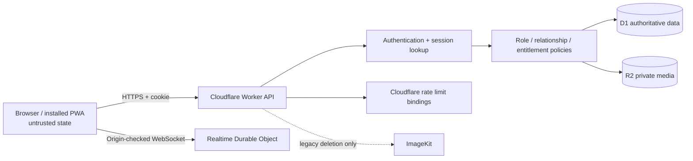

# Qraft threat model

## Assets

Accounts and sessions; singleton Superadmin authority; roles and memberships; paid entitlements, coupons and contribution rewards; private QBanks and questions; exam history/checkpoints; notes and flashcards; review proposals and decisions; reports/tickets; ready-made-test participation and rankings; uploaded R2 media; audit events.

## Actors

- Anonymous visitor or guest test participant.
- Approved Free/Lite/Pro/Unlimited account.
- QBank owner, editor, reviewer, or viewer.
- Platform reviewer, access manager, moderator, or legacy admin role.
- MFA-verified singleton Superadmin.
- Malicious authenticated user changing IDs, payloads, local state, or replaying requests.
- Compromised account or stale PWA/tab/device.

## Trust boundaries

The browser is never authoritative for `userId`, role, plan, ownership, membership, reviewer identity, subscription expiry, or audit authorship. IndexedDB/local state is UX state only.

## Practical abuse cases and controls

| Abuse case | Asset | Primary control | Residual risk |
|---|---|---|---|
| Change an object ID to read/write another user's data | Private data | Authenticated identity plus resource-scoped D1 queries/policies | Endpoint inventory must remain in regression suite |
| Forge role/plan/audit fields | Privilege and audit integrity | Explicit input allowlists and server-derived state | Audit storage is not tamper-evident/WORM |
| Reuse an MFA pre-verification session | Superadmin | Session rotation and old-session deletion | No recovery-code workflow |
| Guess private ready-test media URL | R2 media | Owner/participant/attempt-token authorization | Token is a short-lived URL query capability |
| Tamper with personal backup IDs | User data | HMAC, owner/date binding, structural and collision checks | Key rotation policy is not implemented |
| Replay coupon/review/import actions | Entitlements/integrity | D1 transactions, unique receipts, state transitions, idempotency | Production concurrency not load-tested |
| Stale tab retains old privilege | Roles/plans | Every protected request reevaluates D1 authority | UI may remain stale until its next request |
| Abuse expensive endpoints | Availability | Three Cloudflare limiters and input/item limits | Live edge behavior was not measured |

## Out of scope / not verified

Cloudflare dashboard settings, DNS/TLS posture, WAF rules, origin analytics, real production secrets, third-party account controls, physical device compromise, social engineering, and aggressive production penetration testing.
